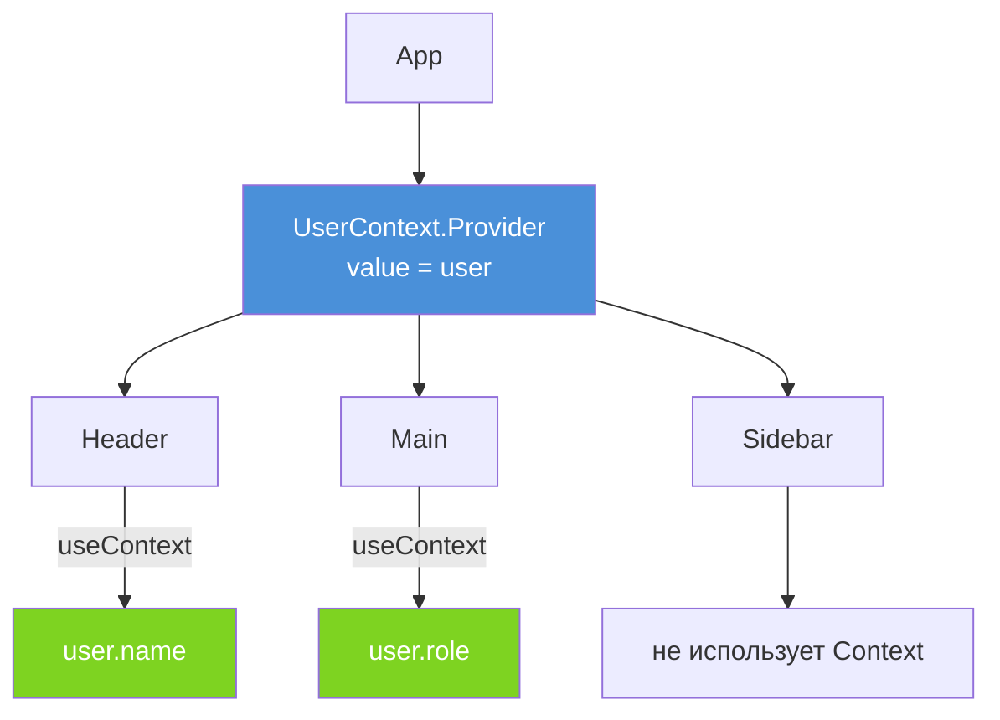

# React Context API

Context API — встроенный механизм React для **совместного использования данных** между компонентами без пробрасывания props через каждый уровень дерева. Решает проблему «prop drilling» — когда данные передаются через компоненты, которым они не нужны.

## Когда использовать Context

- Тема оформления (тёмная / светлая)
- Данные текущего пользователя (имя, роль)
- Язык / локализация интерфейса
- Глобальные настройки приложения

## Как работает Context

Context состоит из трёх частей:

1. **`createContext(defaultValue)`** — создаёт объект контекста
2. **`Provider`** — компонент-обёртка, передающий значение вниз по дереву
3. **`useContext(Context)`** — хук для чтения значения в компоненте

```jsx
// 1. Создаём контекст
const UserContext = React.createContext(null);

// 2. Оборачиваем дерево Provider-ом
function App() {
  const [user, setUser] = React.useState({ name: "Alice", role: "admin" });

  return (
    <UserContext.Provider value={user}>
      <Header />
      <Main />
    </UserContext.Provider>
  );
}

// 3. Читаем значение в любом потомке
function Header() {
  const user = React.useContext(UserContext);
  return <h1>Привет, {user.name}!</h1>;
}
```

## Best practice — выносить в отдельный модуль

```jsx
// contexts/UserContext.jsx
import { createContext, useContext, useState } from "react";

const UserContext = createContext(null);

export function UserProvider({ children }) {
  const [user, setUser] = useState(null);
  return (
    <UserContext.Provider value={{ user, setUser }}>
      {children}
    </UserContext.Provider>
  );
}

export function useUser() {
  return useContext(UserContext);
}

// В любом компоненте:
import { useUser } from "./contexts/UserContext";
function Profile() {
  const { user } = useUser();
  return <p>{user?.name}</p>;
}
```

## Схема



## Ограничения и частые ошибки

| Проблема | Решение |
|---|---|
| Частые обновления → ре-рендер всех потребителей | Разбить на несколько контекстов или обернуть значение в `useMemo` |
| Сложная логика состояния в Provider | Использовать `useReducer` вместо `useState` |
| Нужно глобальное серверное кэширование | Рассмотреть React Query / Zustand / Redux |

## Карточки

- Что такое React Context и когда его использовать?
- Как создать и применить Context API в React?
- Почему не стоит использовать Context для часто меняющихся данных?
