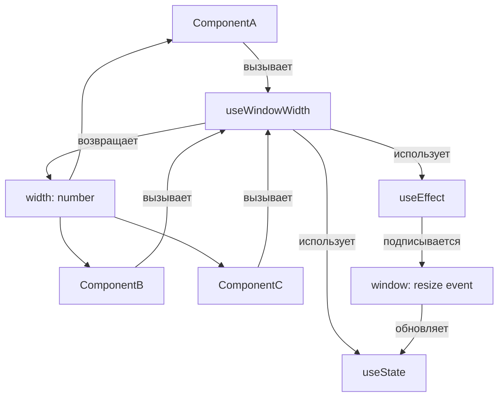

# Custom Hooks в React

Custom hooks — это обычные JavaScript-функции, имя которых начинается с `use`. Они позволяют извлекать повторяющуюся логику с состоянием и эффектами в переиспользуемые единицы, не создавая лишней вложенности в дереве компонентов.

## Зачем нужны custom hooks?

До появления хуков для переиспользования логики использовали Higher-Order Components (HOC) или render props. Оба подхода создают «обёрточный ад» в дереве компонентов. Custom hooks решают ту же задачу чище.

## Правила написания

1. Имя **обязательно** начинается с `use` — иначе линтер не проверяет правила хуков
2. Внутри можно вызывать любые встроенные или другие custom hooks
3. Вызов только на верхнем уровне функции, не внутри условий и циклов

## Пример: useLocalStorage

```js
function useLocalStorage(key, initialValue) {
  const [value, setValue] = useState(() => {
    try {
      return JSON.parse(localStorage.getItem(key)) ?? initialValue;
    } catch {
      return initialValue;
    }
  });

  const setStored = (newValue) => {
    setValue(newValue);
    localStorage.setItem(key, JSON.stringify(newValue));
  };

  return [value, setStored];
}

// Использование
function Settings() {
  const [theme, setTheme] = useLocalStorage('theme', 'light');
  return <button onClick={() => setTheme('dark')}>Dark mode</button>;
}
```

## Пример: useFetch

```js
function useFetch(url) {
  const [data, setData] = useState(null);
  const [loading, setLoading] = useState(true);
  const [error, setError] = useState(null);

  useEffect(() => {
    setLoading(true);
    fetch(url)
      .then(r => r.json())
      .then(setData)
      .catch(setError)
      .finally(() => setLoading(false));
  }, [url]);

  return { data, loading, error };
}
```

## Custom Hook vs HOC

| Критерий | Custom Hook | HOC |
|---|---|---|
| Вложенность | Нет | Добавляет обёртки |
| Отладка в DevTools | Прозрачно | Сложнее |
| Доступ к props | Только явно | Автоматически |
| Рекомендован | ✅ Да | Только если нужна вставка в дерево |

## Схема



## Карточки

- Что такое custom hook в React и зачем он нужен?
- Что будет, если не добавить префикс `use` к custom hook?
- Чем custom hooks лучше HOC и render props?
- Как написать custom hook для работы с localStorage?
