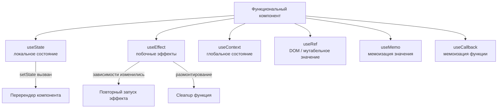

# React Hooks

Хуки — функции, которые позволяют использовать состояние и другие возможности React в функциональных компонентах. Появились в React 16.8 и заменили необходимость в классовых компонентах для большинства задач.

## Основные встроенные хуки

### useState
Хранит локальное состояние компонента. При вызове `setState` компонент перерендеривается.
```jsx
const [count, setCount] = useState(0);
setCount(count + 1);
```

### useEffect
Выполняет побочные эффекты: запросы к API, подписки, работа с DOM. Запускается после рендера.
```jsx
useEffect(() => {
  fetchUser(id);
  return () => cancelRequest(); // cleanup
}, [id]); // повторяется при изменении id
```

### useContext
Читает значение из React Context — избавляет от prop drilling.
```jsx
const theme = useContext(ThemeContext);
```

### useRef
Хранит мутабельное значение без вызова перерендера. Также используется для ссылки на DOM-элементы.
```jsx
const inputRef = useRef(null);
inputRef.current.focus();
```

### useMemo
Мемоизирует результат вычисления — пересчитывает только при изменении зависимостей.
```jsx
const sorted = useMemo(() => [...items].sort(), [items]);
```

### useCallback
Мемоизирует функцию. Полезно, когда функция передаётся как prop дочернему компоненту.
```jsx
const handleClick = useCallback(() => doSomething(id), [id]);
```

## Правила хуков

1. Вызывай хуки только **на верхнем уровне** — не внутри `if`, циклов или вложенных функций.
2. Вызывай хуки только **в функциональных компонентах** или кастомных хуках (начинающихся с `use`).

Эти правила нужны, чтобы React мог гарантировать одинаковый порядок вызова хуков при каждом рендере.

## Схема



## Карточки

- Для чего нужен хук useContext?
- Чем useMemo отличается от useCallback?
- Что такое побочный эффект в контексте useEffect?
- Что хранит useRef и когда его использовать?
- Какие два правила нужно соблюдать при использовании хуков?
