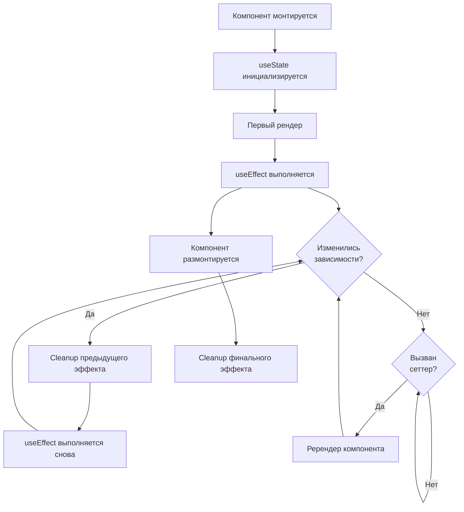

# Хуки React

Хуки (Hooks) — функции, позволяющие использовать состояние и другие возможности React **в функциональных компонентах** без классов. Появились в React 16.8.

## Основные хуки

### useState
Хранит локальное состояние. Возвращает текущее значение и сеттер.

```jsx
const [count, setCount] = useState(0);
setCount(prev => prev + 1); // функциональная форма — безопасна при батчинге
```

### useEffect
Выполняет побочные эффекты: запросы к API, подписки, работа с DOM.

```jsx
useEffect(() => {
  const sub = subscribe(id);
  return () => sub.unsubscribe(); // cleanup при размонтировании
}, [id]); // re-run при изменении id
```

Пустой массив `[]` — эффект выполнится один раз после первого рендера.

### useRef
Хранит мутируемое значение между рендерами без вызова перерендера.

```jsx
const inputRef = useRef(null);
<input ref={inputRef} />
inputRef.current.focus();
```

### useCallback и useMemo
Мемоизация функций и вычисляемых значений.

```jsx
const handler = useCallback(() => doSomething(id), [id]);
const result = useMemo(() => heavyCalc(data), [data]);
```

## Правила хуков

1. Вызывай хуки **только на верхнем уровне** — не внутри `if`, циклов или вложенных функций.
2. Вызывай хуки **только в React-компонентах** или в кастомных хуках (`useXxx`).

Эти правила обеспечивают стабильный порядок вызовов при каждом рендере — именно так React сопоставляет состояние с нужным хуком.

## Схема



## Карточки

- Для чего нужен `useState`?
- Когда выполняется `useEffect` с пустым массивом зависимостей `[]`?
- Чем `useRef` отличается от `useState`?
- Зачем нужен `React.memo`?
- Какие правила использования хуков нужно соблюдать?
