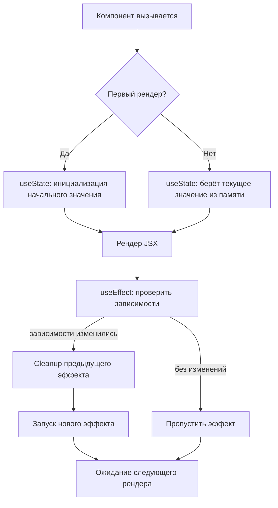

# React Hooks

Hooks — функции, которые позволяют использовать состояние и другие возможности React в функциональных компонентах. Введены в React 16.8, заменили необходимость использовать классовые компоненты.

## Правила Hooks

1. Вызывай хуки только **на верхнем уровне** компонента — не внутри условий, циклов или вложенных функций
2. Вызывай хуки только из **React-функций** — из компонентов или из других кастомных хуков

## Основные хуки

### useState
Хранит локальное состояние компонента. При изменении вызывает ре-рендер.

```js
const [count, setCount] = useState(0);

// Обновление на основе предыдущего значения
setCount(prev => prev + 1);
```

### useEffect
Выполняет побочные эффекты: запросы к API, подписки, таймеры, работа с DOM.

```js
useEffect(() => {
  const sub = subscribe(id);
  return () => sub.unsubscribe(); // cleanup при размонтировании
}, [id]); // зависимости: эффект перезапускается при изменении id
```

| Массив зависимостей | Когда запускается |
|---|---|
| не передан | после каждого рендера |
| `[]` | только один раз (после монтирования) |
| `[a, b]` | при изменении `a` или `b` |

### useMemo и useCallback
Мемоизация для оптимизации: предотвращают лишние вычисления и создание новых ссылок.

```js
// useMemo — кэширует значение
const total = useMemo(() => items.reduce((s, i) => s + i.price, 0), [items]);

// useCallback — кэширует функцию
const handleSubmit = useCallback(() => save(data), [data]);
```

### useRef
Хранит изменяемое значение без ре-рендера. Используется для доступа к DOM-узлам.

```js
const inputRef = useRef(null);

// Прямой доступ к DOM
<input ref={inputRef} />
button onClick={() => inputRef.current.focus()} />
```

### useContext
Позволяет читать значение из Context без prop drilling.

```js
const theme = useContext(ThemeContext); // читаем значение из провайдера
```

## Схема



## Карточки

- Что такое хуки в React и зачем они нужны?
- Чем useState отличается от обычной переменной?
- Когда срабатывает функция cleanup в useEffect?
- Для чего нужны useMemo и useCallback?
- Какие правила нужно соблюдать при использовании хуков?
- Что хранит useRef и когда его используют?
