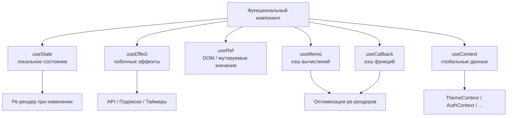

# React Hooks — обзор

Хуки (Hooks) — функции, которые позволяют использовать состояние и другие возможности React в функциональных компонентах без написания классов. Появились в React 16.8.

## Основные хуки

### useState
Управляет локальным состоянием компонента. При изменении состояния компонент ре-рендерится.

```js
const [count, setCount] = useState(0);
setCount(prev => prev + 1);
```

### useEffect
Выполняет побочные эффекты: запросы к API, подписки, работу с DOM. Запускается после рендера.

```js
useEffect(() => {
  fetchUser(id);
}, [id]); // повторить при изменении id
```

### useRef
Хранит изменяемое значение без ре-рендера. Также используется для прямого доступа к DOM-элементам.

```js
const inputRef = useRef(null);
inputRef.current.focus();
```

### useMemo
Кэширует результат вычисления, пересчитывает только при изменении зависимостей.

```js
const sortedList = useMemo(() => list.sort(), [list]);
```

### useCallback
Кэширует функцию — не создаёт новую ссылку при каждом рендере.

```js
const handleClick = useCallback(() => submit(id), [id]);
```

### useContext
Читает значение из React Context без prop drilling.

```js
const theme = useContext(ThemeContext);
```

## Правила хуков

1. Вызывать только на **верхнем уровне** компонента — не внутри условий и циклов
2. Вызывать только в **React-компонентах** или кастомных хуках
3. Кастомный хук — обычная функция, начинающаяся с `use`, которая вызывает другие хуки

```js
function useWindowWidth() {
  const [width, setWidth] = useState(window.innerWidth);
  useEffect(() => {
    const handler = () => setWidth(window.innerWidth);
    window.addEventListener('resize', handler);
    return () => window.removeEventListener('resize', handler);
  }, []);
  return width;
}
```

## Схема



## Карточки

- Для чего нужен хук useMemo?
- Чем useCallback отличается от useMemo?
- Как работает useEffect и что такое dependencies array?
- Для чего используется useRef?
- Как useContext помогает избежать prop drilling?
