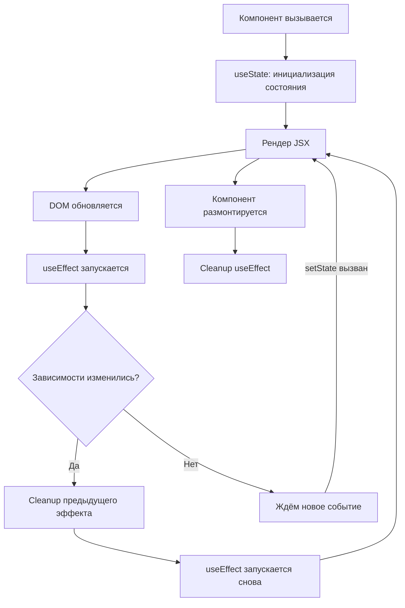

# React Hooks

Хуки (hooks) — это функции, которые позволяют использовать состояние и другие возможности React в функциональных компонентах без написания классов. Введены в React 16.8.

## Основные хуки

**useState** — хранит локальное состояние компонента. При вызове функции-сеттера компонент рендерится заново.

**useEffect** — выполняет побочные эффекты: запросы к API, подписки на события, работу с DOM. Принимает массив зависимостей — если не менять зависимости, эффект не перезапускается.

**useCallback** — кэширует функцию между рендерами. Особенно полезно, когда функция передаётся как пропс дочернему компоненту, чтобы не вызывать лишних рендеров.

**useMemo** — кэширует результат вычисления. Используется для дорогостоящих операций, чтобы не пересчитывать их при каждом рендере.

**useRef** — хранит изменяемое значение (`.current`), которое **не вызывает рендер**. Также используется для прямого доступа к DOM-элементу.

**useContext** — получает текущее значение контекста. Позволяет избежать «проброса пропсов» (props drilling) через несколько уровней.

## Правила хуков

1. Вызывай хуки **только на верхнем уровне** компонента — не внутри `if`, `for` или вложенных функций.
2. Вызывай хуки **только в React-функциях**: функциональных компонентах или кастомных хуках (имя начинается с `use`).

Эти правила обеспечивают стабильный порядок вызовов хуков между рендерами, на котором полагается React.

## Кастомные хуки

Кастомный хук — это обычная функция с префиксом `use`, внутри которой используются стандартные хуки. Позволяет переиспользовать логику между компонентами.

```js
function useFetch(url) {
  const [data, setData] = useState(null);
  const [loading, setLoading] = useState(true);

  useEffect(() => {
    fetch(url)
      .then(res => res.json())
      .then(json => { setData(json); setLoading(false); });
  }, [url]);

  return { data, loading };
}
```

## Схема



## Карточки

- Для чего нужны useMemo и useCallback?
- Что делает хук useEffect в React?
- Как работает useState в React?
