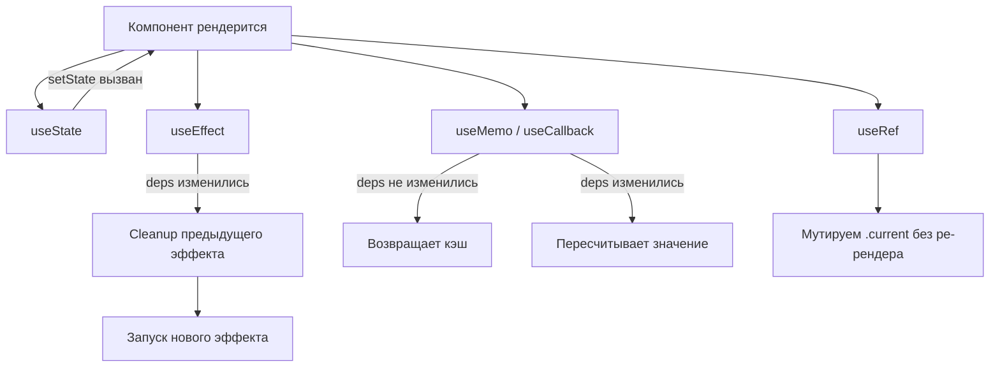

# React Hooks

Хуки — функции, позволяющие использовать состояние и жизненный цикл внутри функциональных компонентов. Появились в React 16.8.

## Основные хуки

**useState** — локальное состояние компонента:
```js
const [count, setCount] = useState(0);
```

**useEffect** — побочные эффекты (запросы, подписки, таймеры):
```js
useEffect(() => {
  const sub = subscribe(id);
  return () => sub.unsubscribe(); // cleanup при размонтировании
}, [id]); // запускается при изменении id
```

**useRef** — мутируемая ссылка, изменение которой не вызывает ре-рендер:
```js
const inputRef = useRef(null);
inputRef.current.focus();
```

**useMemo / useCallback** — мемоизация значений и функций для избежания лишних вычислений.

**useContext** — чтение значения React Context без компонента-Consumer:
```js
const theme = useContext(ThemeContext);
```

## Правила хуков
1. Вызывай только на верхнем уровне компонента — не внутри циклов, условий или вложенных функций.
2. Вызывай только внутри React-функций (компонент или кастомный хук).

## Схема



## Карточки
- Чем отличаются useMemo и useCallback?
- Что такое `this` в JavaScript?
- Что такое деструктуризация в JavaScript?
- Как фильтровать и сортировать данные в SQL?
