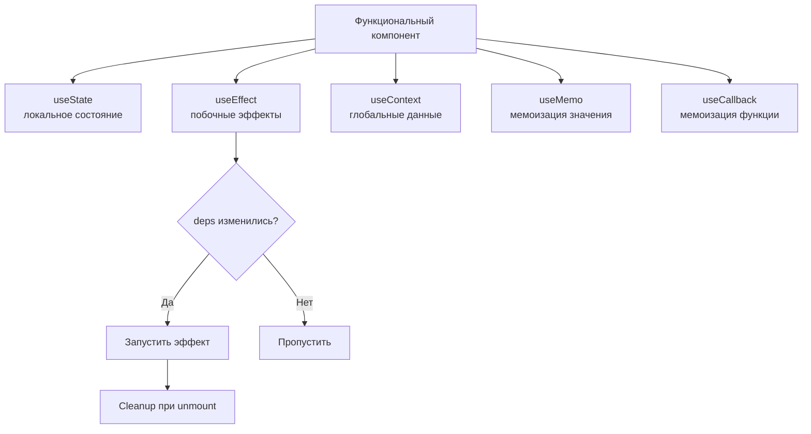

# React Hooks

Хуки (hooks) — функции, которые позволяют **функциональным компонентам** использовать состояние, побочные эффекты и другие возможности React без написания классов. Введены в React 16.8.

## Основные хуки

### useState
Добавляет локальное состояние в компонент. Возвращает текущее значение и функцию-сеттер.

```jsx
const [count, setCount] = useState(0);
// Обновление на основе предыдущего значения:
setCount(prev => prev + 1);
```

### useEffect
Выполняет побочные эффекты (запросы к API, подписки, таймеры) **после рендера**.

```jsx
useEffect(() => {
  const sub = subscribe(id);
  return () => sub.unsubscribe(); // cleanup при размонтировании
}, [id]); // перезапускается при изменении id
// [] — только при монтировании, без [] — после каждого рендера
```

### useContext
Читает значение из ближайшего `Provider`. Избавляет от «prop drilling».

```jsx
const user = useContext(UserContext);
```

### useMemo
Мемоизирует **результат вычисления** — пересчитывает только при изменении зависимостей.

```jsx
const sorted = useMemo(() => [...list].sort(), [list]);
```

### useCallback
Мемоизирует **ссылку на функцию** — полезно при передаче колбэков в дочерние компоненты, обёрнутые в `React.memo`.

```jsx
const handleClick = useCallback(() => doSomething(id), [id]);
```

## Правила хуков (Rules of Hooks)

1. Вызывай хуки **только на верхнем уровне** компонента — не внутри условий, циклов или вложенных функций.
2. Вызывай хуки **только в React-функциях** — в компонентах или кастомных хуках (имя начинается с `use`).

Эти правила гарантируют, что хуки вызываются в одинаковом порядке при каждом рендере.

## Схема



## Карточки
- Что такое useState и как обновлять состояние на основе предыдущего значения?
- Когда и как использовать useContext?
- В чём разница между useMemo и useCallback?
- Что такое правила хуков (Rules of Hooks) и почему они важны?
- Как работает массив зависимостей в useEffect?
