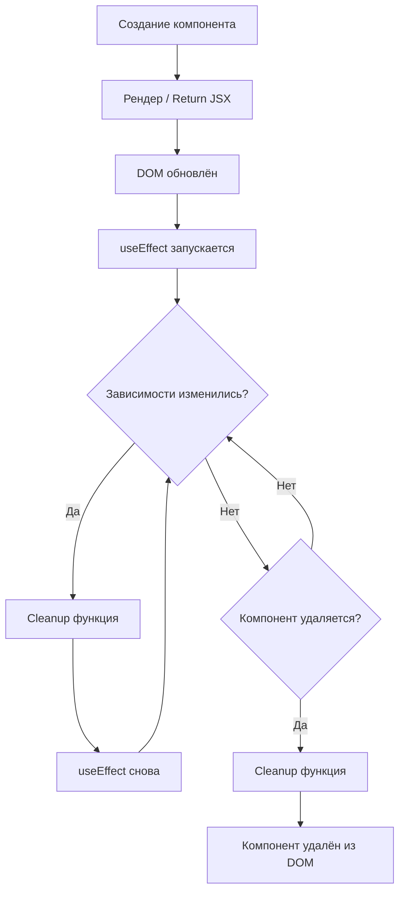

# Жизненный цикл React-компонента

В React каждый компонент проходит через три фазы: **монтирование** (Mounting), **обновление** (Updating) и **размонтирование** (Unmounting). В функциональных компонентах всем этим управляет хук `useEffect`.

## Монтирование

Компонент создаётся и добавляется в DOM. Сайд-эффекты с пустым массивом зависимостей выполняются один раз:

```jsx
useEffect(() => {
  console.log('Компонент смонтирован');
  fetchData();
}, []); // [] — только при монтировании
```

## Обновление

Компонент перерисовывается при изменении `props` или `state`. `useEffect` с зависимостями запускается после каждого изменения указанных значений:

```jsx
useEffect(() => {
  document.title = `Счёт: ${count}`;
}, [count]); // запускается при каждом изменении count
```

## Размонтирование

Компонент удаляется из DOM. Функция-возврат из `useEffect` (cleanup) вызывается перед удалением:

```jsx
useEffect(() => {
  const timer = setInterval(() => tick(), 1000);

  return () => {
    clearInterval(timer); // очистка при размонтировании
  };
}, []);
```

## Схема



## Сравнение с классовыми компонентами

| Фаза | Классовый компонент | Функциональный компонент |
|---|---|---|
| Монтирование | `componentDidMount` | `useEffect(() => {}, [])` |
| Обновление | `componentDidUpdate` | `useEffect(() => {}, [dep])` |
| Размонтирование | `componentWillUnmount` | `return () => {}` внутри useEffect |

## Карточки
- Что такое жизненный цикл React-компонента?
- Как смоделировать `componentDidMount` через `useEffect`?
- Что такое cleanup-функция в `useEffect`?
- Чем `React.memo` отличается от `useMemo`?
