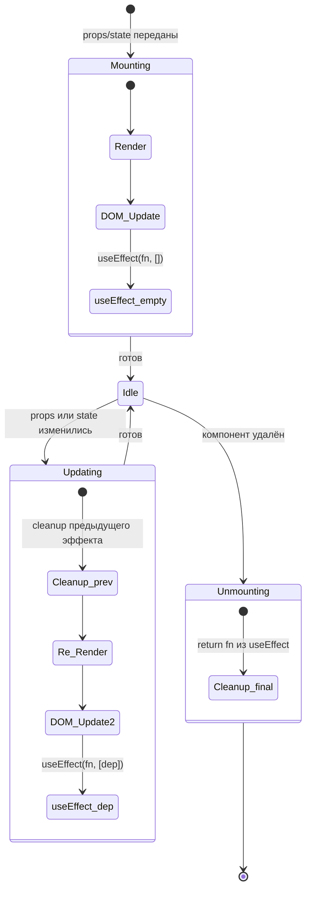

# Жизненный цикл компонента в React

Каждый React-компонент проходит три фазы: **монтирование** (Mount), **обновление** (Update) и **размонтирование** (Unmount). В функциональных компонентах весь жизненный цикл управляется через хук `useEffect`.

## Фазы жизненного цикла

### 1. Монтирование (Mount)
Компонент появляется в DOM первый раз. `useEffect` с пустым массивом зависимостей `[]` запускается **один раз** сразу после первого рендера.

```jsx
useEffect(() => {
  console.log('Компонент смонтирован');
  // Здесь: запросы к API, подписки, инициализация
}, []); // пустой массив = только при монтировании
```

### 2. Обновление (Update)
Компонент перерендеривается при изменении `props` или `state`. `useEffect` с зависимостями запускается при каждом изменении указанных переменных.

```jsx
useEffect(() => {
  // Запускается при изменении userId
  fetch(`/api/users/${userId}`)
    .then(res => res.json())
    .then(setUser);
}, [userId]); // зависимость
```

### 3. Размонтирование (Unmount)
Компонент удаляется из DOM. Функция, возвращаемая из `useEffect`, — это **функция очистки (cleanup)**.

```jsx
useEffect(() => {
  const interval = setInterval(() => tick(), 1000);

  return () => {
    // Вызывается перед размонтированием и перед следующим эффектом
    clearInterval(interval);
  };
}, []);
```

## Сравнение с классовым компонентом

| Функциональный (Hooks) | Классовый компонент |
|---|---|
| `useState(value)` | `this.state = { value }` |
| `useEffect(fn, [])` | `componentDidMount` |
| `useEffect(fn, [dep])` | `componentDidUpdate` |
| `return fn` из useEffect | `componentWillUnmount` |
| `React.memo(Component)` | `shouldComponentUpdate` |

## Порядок вызовов

Важно: `useEffect` выполняется **после** рендера, не во время. Это значит, что DOM уже обновлён к моменту выполнения эффекта.

```jsx
function Component() {
  // 1. Рендер (синхронно)
  console.log('render');

  useEffect(() => {
    // 2. После рендера (асинхронно)
    console.log('effect');
  });

  return <div>Hello</div>;
}
// Вывод: render → (DOM обновлён) → effect
```

## Схема



## Карточки
- Как работает жизненный цикл компонента в React (функциональный)?
- Чем отличается useEffect(fn, []) от useEffect(fn, [dep])?
- Когда запускается функция очистки (cleanup) из useEffect?
