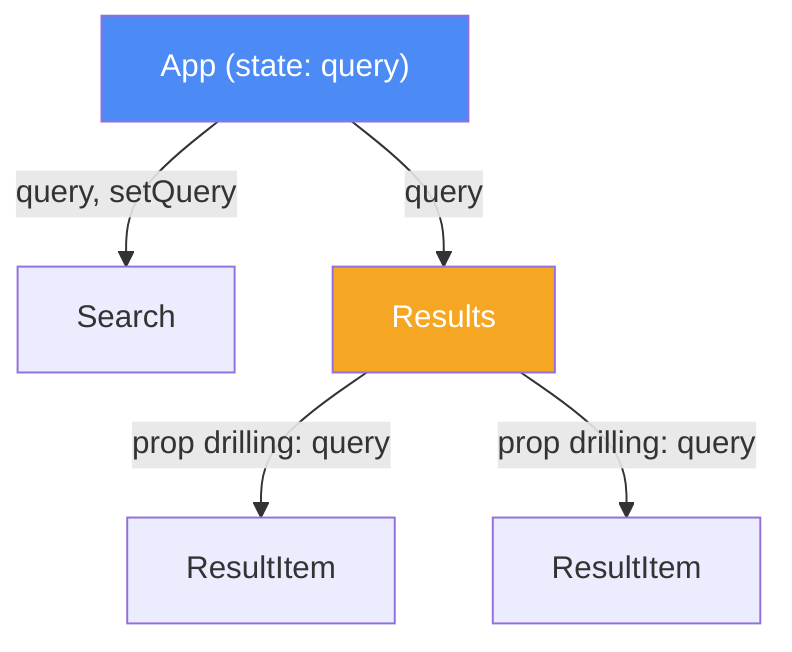

# Lifting State Up и Prop Drilling

Когда двум компонентам React нужен доступ к одному и тому же изменяющемуся значению, самое частое решение — **поднять состояние (lifting state up)** в их общего родителя, а не держать состояние в каждом отдельно.

## Проблема: рассинхронизированное состояние

Если два «братских» компонента хранят своё собственное состояние для одних и тех же данных, они неизбежно рассинхронизируются: изменение в одном не отразится в другом. Решение — единый источник правды (single source of truth) в общем родителе, а дочерние компоненты получают значение и колбэк для изменения через props.

## Проблема: prop drilling

Когда состояние поднято высоко, а использовать его нужно глубоко во вложенном дереве, проп приходится передавать через промежуточные компоненты, которым он сам не нужен — это и называют **prop drilling**. Он делает код многословным и хрупким: изменение сигнатуры промежуточного компонента ломает всю цепочку.

## Когда что использовать

- **Lifting state up** — когда состояние нужно двум-трём близким компонентам. Просто, минимум магии.
- **Context API** — когда проп нужно тащить через много уровней (тема оформления, авторизованный пользователь, язык интерфейса).
- **Redux / Zustand / другой стейт-менеджер** — когда состояние разделяют многие несвязанные части приложения и логика обновлений сложная.

## Схема



Состояние `query` живёт в `App`, и `Results` вынужден прокидывать его дальше в `ResultItem`, хотя сам его не использует — классический prop drilling. Если бы `ResultItem` был на 5 уровней глубже, `Context` избавил бы от цепочки промежуточных пропсов.

## Пример: до и после

```jsx
// До: состояние в каждом компоненте своё — рассинхронизация
function Search() {
  const [query, setQuery] = useState('');
  return <input value={query} onChange={e => setQuery(e.target.value)} />;
}

// После: состояние поднято в App — единый источник правды
function App() {
  const [query, setQuery] = useState('');
  return (
    <>
      <Search query={query} onChange={setQuery} />
      <Results query={query} />
    </>
  );
}

function Search({ query, onChange }) {
  return <input value={query} onChange={e => onChange(e.target.value)} />;
}

function Results({ query }) {
  return <p>Ищем: {query}</p>;
}
```

## Карточки

- Что такое props в React и как их передавать?
- Что такое prop drilling и как его решает lifting state up?
- Когда стоит использовать Context вместо lifting state up?
- Что произойдёт, если два соседних компонента хранят одно и то же состояние по отдельности?
