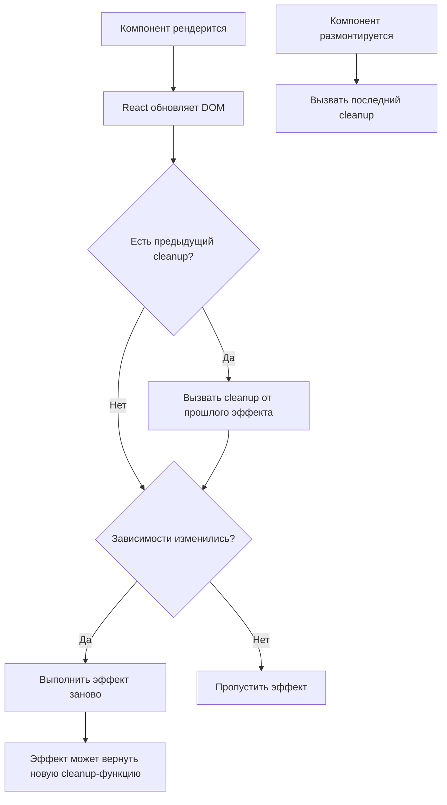

# React useEffect

`useEffect` — хук для выполнения побочных эффектов в функциональных компонентах: запросы к API, подписки, работа с DOM, таймеры. Он связывает жизненный цикл компонента с асинхронным или внешним поведением.

## Когда запускается эффект

Эффект выполняется **после** того, как React отрисовал изменения на экране (после рендера), а не во время самого рендера. Массив зависимостей — второй аргумент — определяет, когда эффект перезапускается.

```jsx
useEffect(() => {
  console.log('Запускается после каждого рендера');
});

useEffect(() => {
  console.log('Запускается один раз — при монтировании');
}, []);

useEffect(() => {
  console.log('Запускается при изменении userId');
  fetchUser(userId);
}, [userId]);
```

## Функция очистки (cleanup)

Если эффект что-то подписывает или создаёт (таймер, слушатель события, соединение), нужно вернуть функцию очистки. Она вызывается **перед** следующим запуском эффекта и при размонтировании компонента.

```jsx
useEffect(() => {
  const timer = setInterval(() => setTick(t => t + 1), 1000);
  return () => clearInterval(timer); // cleanup
}, []);

useEffect(() => {
  const handler = () => console.log('resize');
  window.addEventListener('resize', handler);
  return () => window.removeEventListener('resize', handler);
}, []);
```

## Типичные ошибки

**1. Забытая зависимость (stale closure)** — эффект использует значение из предыдущего рендера:

```jsx
// ❌ count всегда 0 внутри эффекта — замыкание "застряло" на первом рендере
useEffect(() => {
  const id = setInterval(() => setCount(count + 1), 1000);
  return () => clearInterval(id);
}, []); // count пропущен в зависимостях

// ✅ функциональное обновление не зависит от внешнего count
useEffect(() => {
  const id = setInterval(() => setCount(c => c + 1), 1000);
  return () => clearInterval(id);
}, []);
```

**2. Бесконечный цикл** — эффект меняет состояние, от которого сам же зависит, без условия:

```jsx
// ❌ каждый setUser вызывает новый рендер → эффект снова срабатывает
useEffect(() => {
  setUser({ ...user, lastSeen: Date.now() });
}, [user]);
```

**3. Гонка запросов (race condition)** — быстрый ввод в поиске вызывает несколько запросов, и старый может прийти позже нового:

```jsx
useEffect(() => {
  let cancelled = false;

  fetchResults(query).then(data => {
    if (!cancelled) setResults(data);
  });

  return () => { cancelled = true; };
}, [query]);
```

## Схема жизненного цикла эффекта



## useEffect vs useLayoutEffect

| | useEffect | useLayoutEffect |
|---|---|---|
| Когда выполняется | Асинхронно, после отрисовки на экране | Синхронно, до отрисовки |
| Блокирует браузер | Нет | Да |
| Использовать для | Запросы, подписки, логирование | Измерение DOM, синхронная правка layout |

## Карточки

- Когда запускается useEffect и что такое массив зависимостей?
- Зачем нужна функция очистки (cleanup) в useEffect?
- Что такое stale closure и как её избежать с setState(prev => ...)?
- Как избежать race condition при быстром вводе в поиске?
- Чем useLayoutEffect отличается от useEffect?
