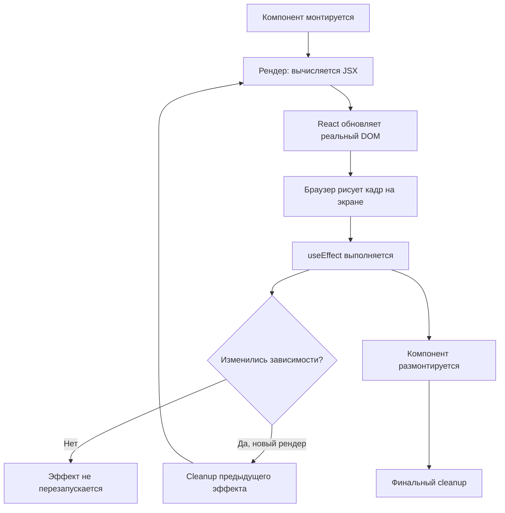

# useEffect и жизненный цикл эффектов в React

`useEffect` — это хук для **побочных эффектов** (side effects): запросов к серверу, подписок, таймеров, ручной работы с DOM — всего, что не является чистым вычислением значения для рендера.

## Зачем это нужно

Компоненты-функции сами по себе описывают только *что* рендерить. Всё, что должно происходить *в ответ* на рендер — синхронизация с внешним миром — вынесено в `useEffect`, чтобы не смешивать это с логикой самого рендера.

Ключевая идея: `useEffect` запускается **после** того, как React обновил реальный DOM, а не во время рендера.

1. React рендерит компонент и обновляет DOM
2. Браузер отрисовывает кадр на экране
3. React выполняет **cleanup-функцию** предыдущего эффекта (если она есть)
4. React выполняет сам эффект

## Схема


```mermaid
flowchart TD
  A[Компонент монтируется] --> B[Рендер: вычисляется JSX]
  B --> C[React обновляет реальный DOM]
  C --> D[Браузер рисует кадр на экране]
  D --> E[useEffect выполняется]
  E --> F{Изменились зависимости?}
  F -->|Да, новый рендер| G[Cleanup предыдущего эффекта]
  G --> B
  F -->|Нет| H[Эффект не перезапускается]
  E --> I[Компонент размонтируется]
  I --> J[Финальный cleanup]
```

## Массив зависимостей

Второй аргумент `useEffect` управляет тем, когда эффект перезапускается:

```jsx
useEffect(() => {
  console.log('после каждого рендера');
});

useEffect(() => {
  console.log('один раз, при монтировании');
}, []);

useEffect(() => {
  fetchUser(userId);
}, [userId]); // при изменении userId
```

## Cleanup-функция

Если эффект что-то "подписывает" (таймер, слушатель события, сокет), он обязан это "отписать" — иначе будет утечка памяти.

```jsx
useEffect(() => {
  const id = setInterval(() => console.log('tick'), 1000);
  return () => clearInterval(id); // выполнится перед следующим эффектом и при размонтировании
}, []);
```

## Частые ошибки junior-разработчиков

- **Забытая зависимость** — эффект использует переменную из замыкания, которая не указана в массиве зависимостей → эффект работает со **старым** (stale) значением.
- **Пустой массив `[]` при использовании внешних переменных** — линтер `eslint-plugin-react-hooks` подскажет об этом через правило `exhaustive-deps`.
- **Отсутствие cleanup** для подписок/таймеров — приводит к утечкам и "эффекту призрака" после размонтирования компонента.
- **useEffect вместо простого вычисления** — если значение можно посчитать прямо во время рендера (`const doubled = count * 2`), не нужно оборачивать это в эффект с `setState`.

## Карточки

- Когда запускается useEffect и что такое массив зависимостей?
- Что произойдёт, если не указать cleanup-функцию для подписки в useEffect?
- Чем плох пустой массив зависимостей `[]`, если внутри эффекта используется внешняя переменная?
- В каком порядке React выполняет рендер, обновление DOM и запуск эффекта?
