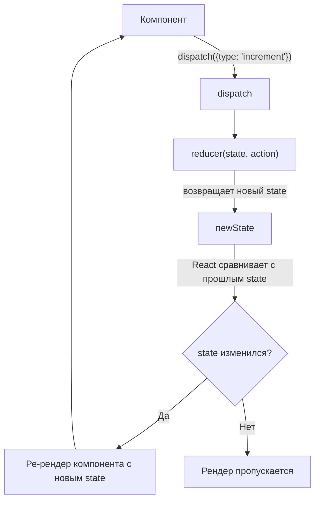

# useReducer в React

`useReducer` — встроенный хук React для управления состоянием через паттерн **action → reducer → new state**, тот же подход, что использует Redux, но без внешней библиотеки.

## Сигнатура

```js
const [state, dispatch] = useReducer(reducer, initialState);
```

- `state` — текущее состояние
- `dispatch(action)` — единственный способ инициировать изменение состояния
- `reducer(state, action)` — чистая функция, которая по текущему состоянию и action возвращает **новое** состояние

## useState vs useReducer

| Критерий | `useState` | `useReducer` |
|---|---|---|
| Простое значение (флаг, строка, число) | ✅ Идеально | Избыточно |
| Несколько связанных полей | Много вызовов `useState` | Один объект состояния |
| Следующее состояние зависит от предыдущего сложным образом | Логика размазана по обработчикам | Вся логика в одном `reducer` |
| Тестируемость логики обновления | Сложно тестировать отдельно | `reducer` — чистая функция, тестируется без React |
| Отладка/логирование изменений | Нужно оборачивать каждый setter | Один центральный `dispatch`, легко залогировать |

## Пример: форма с несколькими полями

```js
const initialState = { name: '', email: '', errors: {} };

function formReducer(state, action) {
  switch (action.type) {
    case 'field_changed':
      return { ...state, [action.field]: action.value };
    case 'validation_failed':
      return { ...state, errors: action.errors };
    case 'reset':
      return initialState;
    default:
      throw new Error(`Unknown action: ${action.type}`);
  }
}

function SignupForm() {
  const [state, dispatch] = useReducer(formReducer, initialState);

  return (
    <input
      value={state.name}
      onChange={(e) =>
        dispatch({ type: 'field_changed', field: 'name', value: e.target.value })
      }
    />
  );
}
```

## Ленивая инициализация

Если начальное состояние дорого вычислять, передаётся третий аргумент — функция `init`, которая выполнится один раз:

```js
const [state, dispatch] = useReducer(reducer, initialArg, init);
```

## Частые ошибки junior-разработчиков

- **Мутация state внутри reducer** — `state.count++` вместо `return { ...state, count: state.count + 1 }`. React не заметит мутацию и не перерендерит компонент.
- **Побочные эффекты внутри reducer** — запросы к API, `setTimeout`, логирование должны быть в `useEffect`, а не в `reducer`. Reducer обязан быть чистой функцией.
- **useReducer ради одного булевого флага** — это переусложнение, здесь достаточно `useState`.

## Схема



## Карточки

- Когда использовать `useReducer` вместо `useState`?
- Что обязано быть чистой функцией в `useReducer` — dispatch или reducer?
- Что произойдёт, если мутировать state прямо внутри reducer?
- Зачем нужна ленивая инициализация (третий аргумент `useReducer`)?
