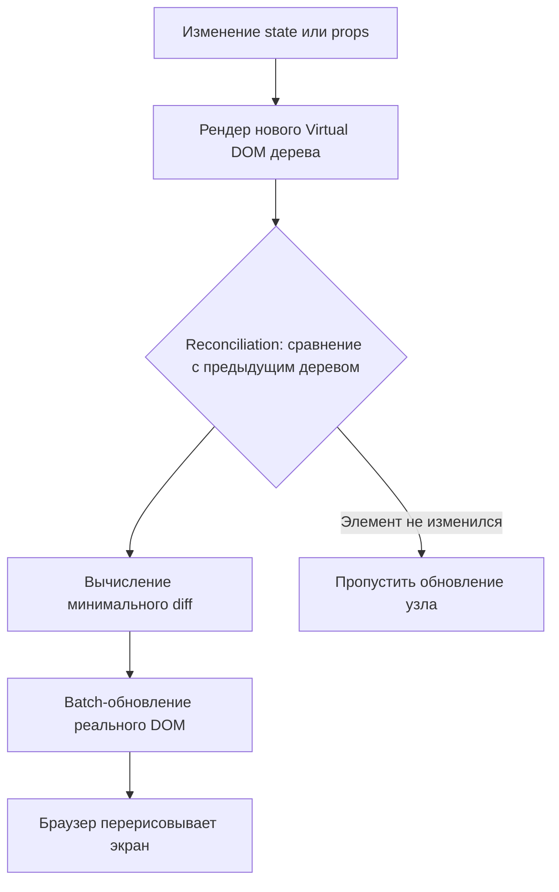

# Virtual DOM и Reconciliation в React

Virtual DOM — это концепция, лежащая в основе производительности React. Это не какая-то магическая технология, а обычное дерево JS-объектов, которое описывает, как должен выглядеть UI.

## Зачем это нужно

Прямая работа с реальным DOM — дорогая операция: браузеру нужно пересчитать стили, layout и перерисовать экран. Если менять DOM на каждое небольшое изменение состояния, интерфейс будет тормозить.

React решает это так:
1. Компонент рендерится в **Virtual DOM** — лёгкое дерево объектов в памяти
2. При изменении state/props строится **новое** Virtual DOM дерево
3. React сравнивает старое и новое дерево — этот процесс называется **reconciliation**
4. Вычисляется минимальный набор реальных DOM-операций (**diffing**)
5. Изменения применяются к реальному DOM одним пакетом (**commit**)

## Схема



## Роль key при рендере списков

React сравнивает элементы списка по `key`, чтобы понять, какие узлы переиспользовать, а какие пересоздать.

```jsx
// Плохо: key = индекс, ломается при изменении порядка
items.map((item, i) => <li key={i}>{item.text}</li>);

// Хорошо: key = стабильный уникальный id
items.map((item) => <li key={item.id}>{item.text}</li>);
```

Без стабильного `key` React может неправильно сопоставить старые и новые элементы, что приводит к лишним перерисовкам или потере локального состояния (например, значения в `<input>`).

## Fiber — архитектура под капотом

Начиная с React 16, reconciliation работает на архитектуре **Fiber**. Она разбивает работу по рендерингу на маленькие единицы, которые можно прерывать и возобновлять — это позволяет React отдавать приоритет срочным обновлениям (например, вводу текста) над менее важными (рендер большого списка в фоне).

## Частое заблуждение

Virtual DOM не делает React «быстрее браузера» сам по себе — прямые точечные манипуляции с DOM через `vanilla JS` могут быть быстрее для одной операции. Преимущество Virtual DOM — в предсказуемом декларативном коде и автоматической оптимизации **пакетных** обновлений при сложных, часто меняющихся интерфейсах.

## Карточки

- Что такое Virtual DOM в React и зачем он нужен?
- Что такое reconciliation и из каких шагов состоит цикл обновления?
- Почему нельзя использовать индекс массива как key в списке?
- Что такое архитектура Fiber и какую проблему она решает?
