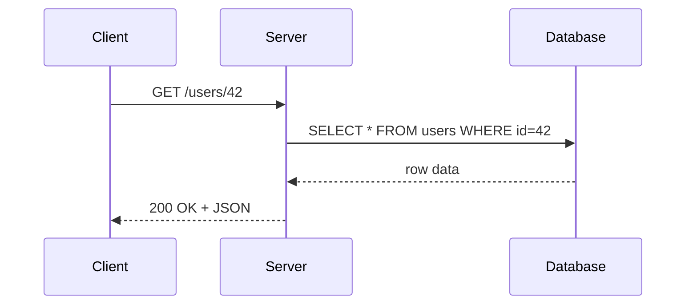

# REST API

REST (Representational State Transfer) — архитектурный стиль для построения веб-сервисов. Не протокол, не стандарт — набор принципов.

## Основные принципы

**Stateless** — каждый запрос содержит всю нужную информацию. Сервер не хранит состояние клиента между запросами.

**Ресурсы** — всё есть ресурс, у каждого есть URL:
- `/users` — коллекция пользователей
- `/users/42` — конкретный пользователь
- `/users/42/posts` — посты пользователя

**HTTP методы** — действия выражаются методами:

| Метод | Действие | Пример |
|-------|----------|--------|
| GET | Получить | GET /users |
| POST | Создать | POST /users |
| PUT | Заменить | PUT /users/42 |
| PATCH | Частично обновить | PATCH /users/42 |
| DELETE | Удалить | DELETE /users/42 |

## Схема запрос-ответ



## HTTP статус коды

```
2xx — Успех
  200 OK           — запрос выполнен
  201 Created      — ресурс создан
  204 No Content   — успех, тела нет

4xx — Ошибка клиента
  400 Bad Request  — неверный запрос
  401 Unauthorized — нужна авторизация
  403 Forbidden    — нет прав
  404 Not Found    — ресурс не найден

5xx — Ошибка сервера
  500 Internal Server Error
  503 Service Unavailable
```

## Пример на Express

```js
const express = require('express');
const app = express();
app.use(express.json());

app.get('/users', (req, res) => {
  res.json(users);
});

app.post('/users', (req, res) => {
  const user = { id: Date.now(), ...req.body };
  users.push(user);
  res.status(201).json(user);
});

app.delete('/users/:id', (req, res) => {
  users = users.filter(u => u.id !== +req.params.id);
  res.status(204).send();
});
```

## Карточки

- Что такое REST и каковы его основные принципы?
- Чем отличается PUT от PATCH?
- Что означает Stateless в контексте REST?
- Какой HTTP код возвращается при успешном создании ресурса?
- В чём разница между 401 и 403?
