# REST vs GraphQL: два подхода к проектированию API

**REST** и **GraphQL** решают одну задачу — дать клиенту доступ к данным сервера — но по-разному распределяют ответственность между клиентом и сервером за то, какая структура ответа получится.

## REST: ресурсы и фиксированная форма ответа

В REST каждый ресурс живёт по своему URL, а форму ответа определяет сервер:

```http
GET /api/users/42

{ "id": 42, "name": "Alex", "email": "alex@mail.com", "createdAt": "2024-01-01", "role": "admin", ... }
```

Если клиенту нужно только `name`, он всё равно получает весь объект — это **over-fetching**. Если клиенту нужны ещё и заказы пользователя, придётся сделать второй запрос — это **under-fetching**:

```http
GET /api/users/42
GET /api/users/42/orders
```

## GraphQL: клиент описывает форму ответа сам

GraphQL переворачивает модель: один эндпоинт, а клиент в теле запроса явно перечисляет нужные поля — сервер вернёт ровно их и ничего лишнего:

```graphql
query {
  user(id: 42) {
    name
    orders {
      total
      status
    }
  }
}
```

```json
{
  "data": {
    "user": {
      "name": "Alex",
      "orders": [{ "total": 1500, "status": "paid" }]
    }
  }
}
```

Один запрос вместо двух, и ответ содержит только запрошенные поля.

## Схема: путь запроса в REST и GraphQL

```mermaid
flowchart TD
    subgraph REST["REST — фиксированная форма ответа"]
        R1["Клиент: GET /users/42"] --> R2["Сервер отдаёт ВСЕ поля юзера"]
        R2 --> R3["Клиенту нужны ещё заказы"]
        R3 --> R4["Клиент: GET /users/42/orders"]
        R4 --> R5["Сервер отдаёт заказы отдельным ответом"]
    end

    subgraph GQL["GraphQL — клиент описывает форму"]
        G1["Клиент: query { user { name orders { total } } }"] --> G2["Сервер вызывает resolver user()"]
        G2 --> G3["Resolver user.orders() достаёт заказы"]
        G3 --> G4["Сервер собирает ровно запрошенные поля"]
        G4 --> G5["Один ответ с нужными данными"]
    end
```



## Скрытая цена GraphQL: N+1 на уровне resolver'ов

GraphQL решает over/under-fetching на транспортном уровне, но не гарантирует эффективность на уровне базы данных. Если резолвер `orders` для каждого пользователя в списке делает отдельный запрос к БД, при выводе 100 пользователей сервер сделает 1 (за список) + 100 (за заказы каждого) = 101 запрос — та же проблема **N+1**, что встречается и в обычных ORM-запросах (см. `sql-n-plus-one`), просто перенесённая в resolver-слой GraphQL. Решается батчингом запросов (например, паттерном DataLoader), который собирает id за один «тик» event loop и делает один SQL-запрос с `WHERE id IN (...)` вместо множества отдельных.

## Сравнение

| Критерий | REST | GraphQL |
|---|---|---|
| Количество эндпоинтов | Много, по одному на ресурс | Один |
| Форму ответа определяет | Сервер | Клиент |
| Over-fetching | Частая проблема | Решена на уровне запроса |
| Under-fetching (несколько round-trip) | Частая проблема | Решена — вложенные данные одним запросом |
| HTTP-кэширование по URL | Простое | Сложнее (нужны отдельные инструменты кэширования) |
| Типизация контракта | Через документацию (OpenAPI) | Встроенная схема (SDL) |
| Риск N+1 к базе данных | Есть, но виден в одном контроллере | Есть, скрыт в дереве resolver'ов — сложнее заметить |

## Когда что выбирать

- **REST** подходит для простых CRUD-сервисов с предсказуемой, редко меняющейся структурой данных и когда важно простое HTTP-кэширование.
- **GraphQL** оправдан, когда разным клиентам (мобильное приложение, веб, партнёрские интеграции) нужны сильно разные наборы полей с одних и тех же сущностей, и цена содержания схемы/resolver-слоя окупается экономией на round-trip'ах.

## Карточки

- Чем REST отличается от GraphQL с точки зрения формы ответа?
- Что такое over-fetching и under-fetching и как GraphQL их решает?
- Как в GraphQL может возникнуть проблема N+1 и при чём тут DataLoader?
- В каких случаях лучше выбрать REST, а в каких — GraphQL?