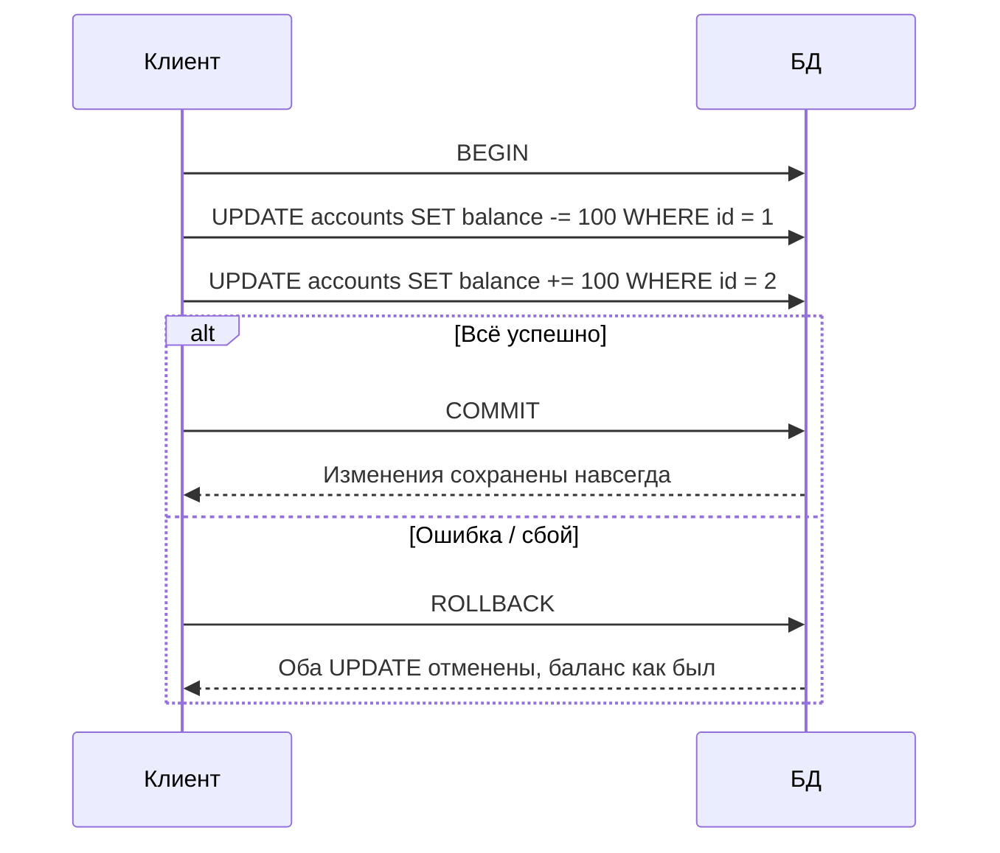

# Транзакции и ACID в SQL

Транзакция — последовательность операций с базой данных, которая выполняется как единое целое: либо применяется целиком, либо не применяется вовсе. **ACID** — набор из четырёх свойств, которые делают транзакции надёжными.

## Atomicity — атомарность

Все операции внутри транзакции — единое целое. Если хотя бы одна упадёт, откатываются все остальные.

```sql
BEGIN;
UPDATE accounts SET balance = balance - 100 WHERE id = 1;
UPDATE accounts SET balance = balance + 100 WHERE id = 2;
COMMIT;
```

Если сбой произойдёт между двумя `UPDATE`, ни один из них не применится — счета останутся в исходном состоянии.

## Consistency — согласованность

БД переходит из одного валидного состояния в другое, не нарушая ограничения: `FOREIGN KEY`, `UNIQUE`, `CHECK`, триггеры. Транзакция, которая нарушает constraint, откатывается целиком.

## Isolation — изоляция

Параллельные транзакции не должны видеть промежуточные (незакоммиченные) изменения друг друга. Уровень изоляции регулирует, какими "аномалиями" можно пожертвовать ради скорости:

| Уровень изоляции | Dirty read | Non-repeatable read | Phantom read |
|---|---|---|---|
| Read Uncommitted | Возможен | Возможен | Возможен |
| Read Committed | Нет | Возможен | Возможен |
| Repeatable Read | Нет | Нет | Возможен |
| Serializable | Нет | Нет | Нет |

- **Dirty read** — чтение незакоммиченных данных другой транзакции
- **Non-repeatable read** — повторный `SELECT` в одной транзакции возвращает другие данные, потому что их изменила и закоммитила другая транзакция
- **Phantom read** — повторный `SELECT` с тем же условием возвращает другой набор строк (появились/исчезли новые)

## Durability — долговечность

После `COMMIT` данные гарантированно сохраняются, даже если сервер БД упадёт сразу после подтверждения — обычно за счёт записи в write-ahead log (WAL) на диск.

## Схема



## Зачем это знать

Без ACID перевод денег мог бы списаться с одного счёта и не дойти до другого — типичный источник "пропавших" данных в системах без транзакций. Понимание уровней изоляции помогает выбрать баланс между корректностью и производительностью под нагрузкой.

## Карточки

- Что такое ACID?
- Что произойдёт, если сбой случится между двумя `UPDATE` внутри одной транзакции?
- Чем dirty read отличается от non-repeatable read?
- Какой уровень изоляции полностью исключает phantom read?
