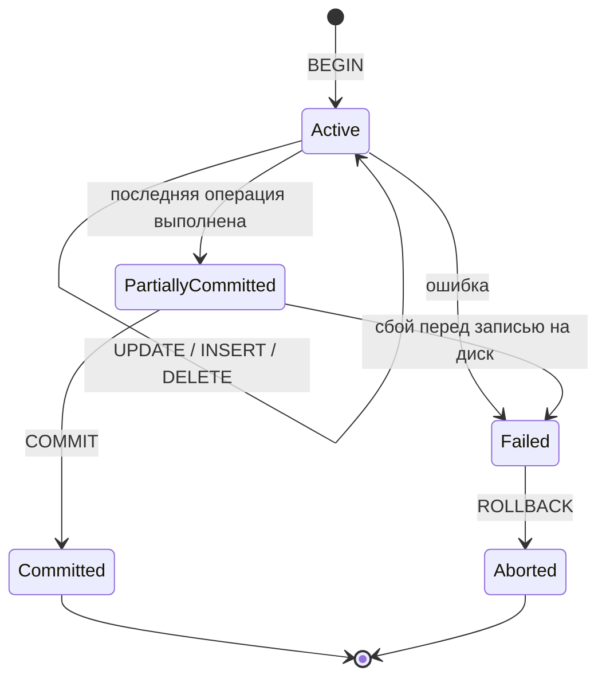

# ACID: свойства транзакций в SQL

Транзакция — это последовательность операций с базой данных, которая выполняется как единое целое: либо применяются все изменения, либо ни одного. **ACID** — акроним из четырёх свойств, которые должна обеспечивать любая надёжная транзакционная СУБД (PostgreSQL, MySQL, Oracle и др.).

## Atomicity — атомарность

Транзакция неделима: если хотя бы одна операция внутри неё завершилась ошибкой, отменяются **все** изменения транзакции (`ROLLBACK`). Частично выполненных транзакций не существует.

```sql
BEGIN;
UPDATE accounts SET balance = balance - 100 WHERE id = 1;
UPDATE accounts SET balance = balance + 100 WHERE id = 2;
COMMIT;
```

Если вторая строка упадёт с ошибкой (например, нарушение constraint), первая тоже откатится — деньги со счёта 1 не спишутся впустую.

## Consistency — согласованность

БД переходит из одного валидного состояния в другое: все ограничения (`CHECK`, `FOREIGN KEY`, `UNIQUE`) должны выполняться до и после транзакции. Транзакция, нарушающая инвариант данных, откатывается целиком.

## Isolation — изолированность

Параллельно выполняющиеся транзакции не должны видеть промежуточные (незакоммиченные) изменения друг друга. Уровень изоляции настраивается и определяет, какие аномалии допустимы:

| Уровень | Грязное чтение | Неповторяемое чтение | Фантомное чтение |
|---|---|---|---|
| READ UNCOMMITTED | возможно | возможно | возможно |
| READ COMMITTED | нет | возможно | возможно |
| REPEATABLE READ | нет | нет | возможно |
| SERIALIZABLE | нет | нет | нет |

## Durability — устойчивость

После успешного `COMMIT` изменения гарантированно сохраняются, даже если сразу после этого произойдёт сбой питания или падение сервера. СУБД добивается этого через журналирование (write-ahead log).

## Схема



## Карточки

- Что такое ACID и почему это важно для транзакций?
- Что произойдёт, если транзакция не завершится COMMIT-ом?
- Чем REPEATABLE READ отличается от SERIALIZABLE?
