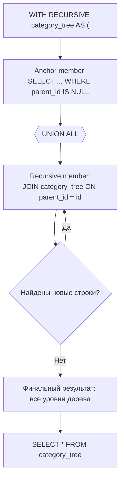

# Common Table Expressions (CTE) в SQL

**CTE (Common Table Expression)** — именованный временный набор результатов, объявляемый ключевым словом `WITH` перед основным запросом. Он существует только на время выполнения запроса и не сохраняется в базе как таблица или view.

## Зачем нужны CTE

Без CTE сложную логику приходится записывать вложенными подзапросами, которые тяжело читать «изнутри наружу». CTE позволяет описать запрос как последовательность именованных шагов сверху вниз — так же, как переменные в обычном коде.

```sql
-- Без CTE: подзапрос внутри подзапроса
SELECT department, AVG(salary)
FROM (
  SELECT department, salary
  FROM (
    SELECT * FROM employees WHERE active = true
  ) e
) sub
GROUP BY department;

-- С CTE: читается последовательно
WITH active_employees AS (
  SELECT * FROM employees WHERE active = true
)
SELECT department, AVG(salary)
FROM active_employees
GROUP BY department;
```

## Несколько CTE в одном запросе

Через запятую можно объявить несколько CTE, причём поздние могут ссылаться на ранние:

```sql
WITH dept_totals AS (
  SELECT department_id, SUM(salary) AS total
  FROM employees
  GROUP BY department_id
),
top_departments AS (
  SELECT department_id
  FROM dept_totals
  WHERE total > 500000
)
SELECT * FROM employees
WHERE department_id IN (SELECT department_id FROM top_departments);
```

## Рекурсивный CTE

`WITH RECURSIVE` решает задачи с иерархическими или графовыми данными: деревья категорий, оргструктуры, маршруты. Состоит из двух частей, соединённых `UNION ALL`:

1. **Анкор (anchor member)** — начальная выборка (корень дерева)
2. **Рекурсивная часть** — ссылается сама на себя, добавляя следующий уровень, пока не перестанет находить новые строки

```sql
WITH RECURSIVE category_tree AS (
  SELECT id, name, parent_id, 1 AS depth
  FROM categories
  WHERE parent_id IS NULL

  UNION ALL

  SELECT c.id, c.name, c.parent_id, ct.depth + 1
  FROM categories c
  JOIN category_tree ct ON c.parent_id = ct.id
)
SELECT * FROM category_tree ORDER BY depth;
```

## CTE vs подзапрос vs временная таблица

| Критерий | CTE | Подзапрос | Временная таблица |
|---|---|---|---|
| Читаемость | Высокая | Низкая при вложенности | Высокая |
| Живёт после запроса | Нет | Нет | Да (в рамках сессии) |
| Может быть рекурсивным | Да | Нет | Нет |
| Переиспользование в запросе | Да, по имени | Нет, дублировать | Да |
| Индексы | Нет | Нет | Можно создать |

## Схема



## Карточки

- Что такое CTE (Common Table Expressions) в SQL и когда их использовать?
- Чем рекурсивный CTE отличается от обычного?
- В чём разница между CTE, подзапросом и временной таблицей?
