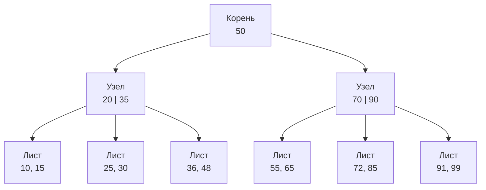

# SQL Индексы

**Индекс** — вспомогательная структура данных, которую СУБД строит поверх таблицы, чтобы ускорить поиск. Работает как алфавитный указатель в книге: вместо того чтобы листать всё, сразу открываешь нужную страницу.

Без индекса база выполняет **Sequential Scan (Seq Scan)** — читает каждую строку таблицы. При наличии индекса — **Index Scan** за O(log n).

## Как работает B-tree индекс

По умолчанию PostgreSQL и MySQL используют **B-tree (сбалансированное дерево)**. Все значения хранятся в узлах, отсортированными. Поиск нужного значения — спуск по дереву от корня к листу.

## Схема



## Виды индексов

| Тип | Описание | Пример |
|-----|----------|---------|
| Обычный (B-tree) | Стандартный, подходит для `=`, `<`, `>`, `BETWEEN` | `CREATE INDEX idx ON t(col)` |
| Уникальный | Запрещает дубликаты значений | `CREATE UNIQUE INDEX ...` |
| Составной | На несколько колонок сразу | `CREATE INDEX idx ON t(a, b)` |
| Частичный | Только для строк по условию | `CREATE INDEX idx ON t(col) WHERE active = true` |
| Полнотекстовый | Поиск по тексту (GIN/GiST) | `CREATE INDEX idx ON t USING gin(col)` |

## Когда индекс помогает

```sql
-- Индекс используется
SELECT * FROM users WHERE email = 'test@mail.com';
SELECT * FROM orders WHERE user_id = 42 ORDER BY created_at;

-- Индекс НЕ используется (функция над колонкой блокирует индекс)
SELECT * FROM users WHERE LOWER(email) = 'test@mail.com';
-- Решение: создать функциональный индекс
CREATE INDEX idx_lower_email ON users(LOWER(email));

-- Проверяем план выполнения
EXPLAIN ANALYZE SELECT * FROM users WHERE email = 'test@mail.com';
```

## Плюсы и минусы

**Плюсы:**
- Ускоряет `SELECT`, `JOIN`, `ORDER BY`, `GROUP BY` по индексированным колонкам
- Уникальный индекс гарантирует целостность данных

**Минусы:**
- Замедляет `INSERT`, `UPDATE`, `DELETE` — каждая операция обновляет индекс
- Занимает дополнительное место на диске
- Слишком много индексов = деградация производительности записи

## Правило: когда добавлять индекс

1. Колонка часто встречается в `WHERE` или `JOIN ON`
2. Таблица содержит тысячи+ строк
3. `EXPLAIN` показывает `Seq Scan` на медленном запросе
4. Для составного индекса: сначала ставь колонку с высокой **селективностью** (много уникальных значений)

## Карточки

- Что такое индексы в SQL и зачем они нужны?
- Почему индекс замедляет INSERT/UPDATE/DELETE?
- Что такое составной индекс и почему важен порядок столбцов?
- Как проверить, использует ли запрос индекс?
- Когда индекс не работает, даже если создан?
