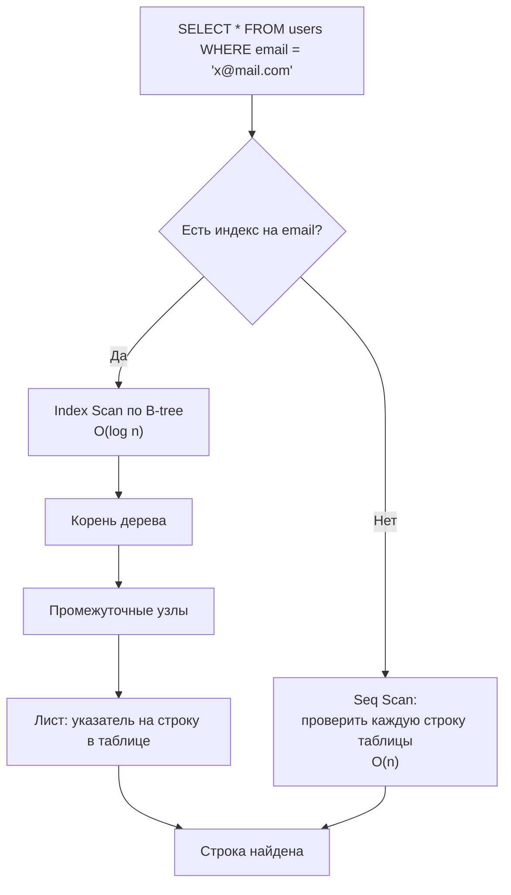

# SQL Indexes

**Индекс** — вспомогательная структура данных (чаще всего **B-tree**), которая ускоряет поиск строк в таблице, не заставляя СУБД перебирать таблицу целиком.

## Зачем нужен индекс

Без индекса поиск по колонке — это **full table scan**: СУБД читает каждую строку таблицы и проверяет условие. Для таблицы из 10 000 000 строк это медленно.

С индексом на нужной колонке СУБД строит B-tree — сбалансированное дерево, где поиск занимает `O(log n)` вместо `O(n)`.

```sql
-- Без индекса: full table scan
SELECT * FROM users WHERE email = 'alex@example.com';

-- Создаём индекс на колонке email
CREATE INDEX idx_users_email ON users(email);

-- Теперь тот же запрос использует индекс — B-tree lookup
SELECT * FROM users WHERE email = 'alex@example.com';
```

## Составные индексы и порядок колонок

Индекс на нескольких колонках работает как телефонная книга: сначала сортировка по первой колонке, затем по второй **внутри** первой.

```sql
CREATE INDEX idx_orders_user_date ON orders(user_id, created_at);

-- Использует индекс полностью
SELECT * FROM orders WHERE user_id = 42 AND created_at > '2026-01-01';

-- Использует индекс частично (только по user_id)
SELECT * FROM orders WHERE user_id = 42;

-- НЕ использует индекс — created_at не первая колонка
SELECT * FROM orders WHERE created_at > '2026-01-01';
```

**Правило:** самая избирательная и часто используемая в одиночных запросах колонка идёт первой.

## Проверка через EXPLAIN

```sql
EXPLAIN SELECT * FROM users WHERE email = 'alex@example.com';
```

- `Seq Scan` (или `Full Table Scan`) — индекс не используется, СУБД читает всю таблицу.
- `Index Scan` / `Index Seek` — индекс работает.

## Цена индекса

Индекс — не бесплатный ускоритель:

- Каждый `INSERT` / `UPDATE` / `DELETE` должен обновить не только таблицу, но и все её индексы.
- Индекс занимает место на диске (может быть сопоставим с размером таблицы).
- Слишком много индексов на таблице с частой записью — записи заметно замедляются.

**Когда ставить:** колонки в `WHERE`, `JOIN ON`, `ORDER BY` на больших и часто читаемых таблицах.
**Когда не ставить:** маленькие таблицы, колонки с низкой избирательностью (например, boolean-флаг с 2 значениями), таблицы с очень частой записью и редким чтением.

## Схема


```mermaid
flowchart TD
    Q["SELECT * FROM users WHERE email = 'x@mail.com'"] --> D{Есть индекс на email?}
    D -- Нет --> S["Seq Scan:\nпроверить каждую строку таблицы\nO(n)"]
    D -- Да --> B["Index Scan по B-tree\nO(log n)"]
    B --> L1["Корень дерева"]
    L1 --> L2["Промежуточные узлы"]
    L2 --> L3["Лист: указатель на строку в таблице"]
    L3 --> R["Строка найдена"]
    S --> R
```

## Карточки

- Что такое индекс в SQL и зачем он нужен?
- Почему составной индекс `(user_id, created_at)` не поможет запросу с фильтром только по `created_at`?
- Как узнать, использует ли запрос индекс?
- Какую цену платит база данных за каждый созданный индекс?
