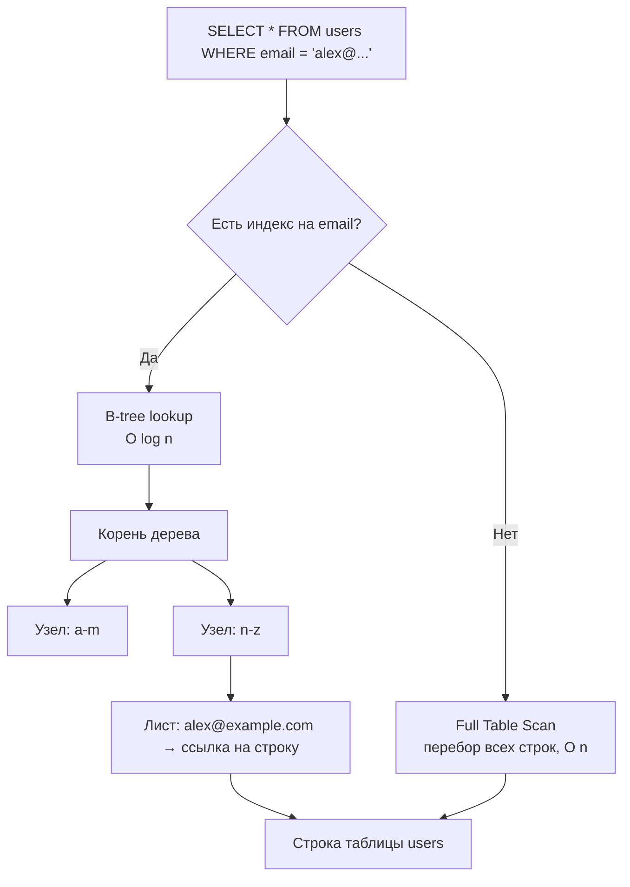

# Индексы в SQL

**Индекс** — вспомогательная структура данных (чаще всего **B-tree**), которая ускоряет поиск строк в таблице, не заставляя базу перебирать её целиком. Без индекса любой `WHERE`, `JOIN` или `ORDER BY` по колонке превращается в **full table scan** — линейный перебор всех строк.

## Зачем нужен индекс

Представьте телефонную книгу без алфавитного порядка — чтобы найти абонента, пришлось бы читать её от начала до конца. Индекс — это и есть алфавитный порядок: база строит отдельную отсортированную структуру со ссылками на реальные строки таблицы.

```sql
-- Без индекса: full table scan, O(n)
SELECT * FROM users WHERE email = 'alex@example.com';

-- Создаём индекс
CREATE INDEX idx_users_email ON users(email);

-- Теперь тот же запрос: B-tree lookup, O(log n)
SELECT * FROM users WHERE email = 'alex@example.com';
```

## Виды индексов

| Тип | Синтаксис | Когда использовать |
|---|---|---|
| Обычный | `CREATE INDEX idx ON t(col)` | Поиск по одной колонке |
| Составной | `CREATE INDEX idx ON t(col1, col2)` | Фильтрация/сортировка по нескольким колонкам сразу |
| Уникальный | `CREATE UNIQUE INDEX idx ON t(col)` | Гарантия уникальности + ускорение поиска |
| Частичный | `CREATE INDEX idx ON t(col) WHERE active = true` | Индексировать только нужное подмножество строк |

**Порядок колонок в составном индексе важен**: индекс `(user_id, created_at)` ускорит запросы с фильтром по `user_id` или по `user_id + created_at`, но **не поможет** запросу, где фильтруется только `created_at`.

## Цена индекса

Индексы не бесплатны:

- Каждый `INSERT`/`UPDATE`/`DELETE` должен обновить не только таблицу, но и все её индексы
- Индекс занимает дополнительное место на диске
- Слишком много индексов на таблице с частой записью может заметно замедлить запись

Поэтому индекс имеет смысл ставить на колонки, которые часто участвуют в `WHERE`, `JOIN ON` и `ORDER BY`, и в первую очередь на больших таблицах (от десятков тысяч строк), где выигрыш в чтении перевешивает цену записи.

## Как проверить, используется ли индекс

```sql
EXPLAIN ANALYZE
SELECT * FROM users WHERE email = 'alex@example.com';

-- Ищем в плане запроса:
-- Index Scan using idx_users_email  →  индекс используется
-- Seq Scan on users                 →  индекс НЕ используется (или его нет)
```

Индекс может не использоваться, даже если он существует — например, если оптимизатор решил, что при выборке большей части таблицы full scan дешевле, чем построчный переход по индексу.

## Схема


```mermaid
graph TD
    Q[SELECT * FROM users WHERE email = 'alex@...'] --> D{Есть индекс на email?}
    D -->|Нет| SCAN[Full Table Scan<br/>перебор всех строк, O n]
    D -->|Да| BTREE[B-tree lookup<br/>O log n]
    BTREE --> ROOT[Корень дерева]
    ROOT --> N1[Узел: a-m]
    ROOT --> N2[Узел: n-z]
    N2 --> LEAF[Лист: alex@example.com → ссылка на строку]
    LEAF --> ROW[Строка таблицы users]
    SCAN --> ROW
```

## Карточки

- Что такое индекс в SQL и зачем он нужен?
- Почему порядок колонок важен в составном индексе?
- Какую цену платит база данных за наличие индекса?
- Как проверить через EXPLAIN, используется ли индекс в запросе?
- В каких случаях индекс лучше не ставить?
