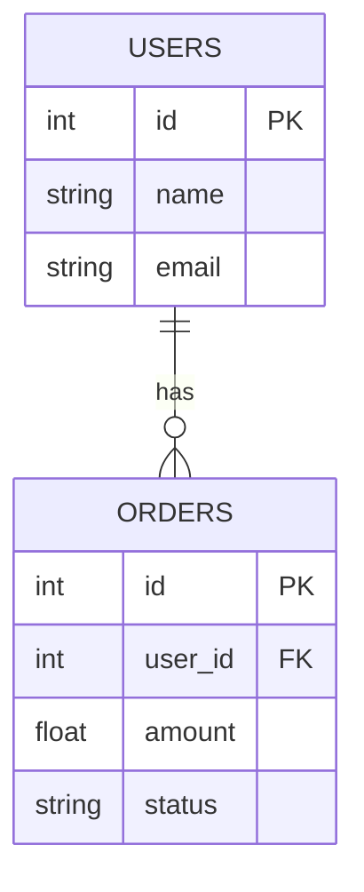
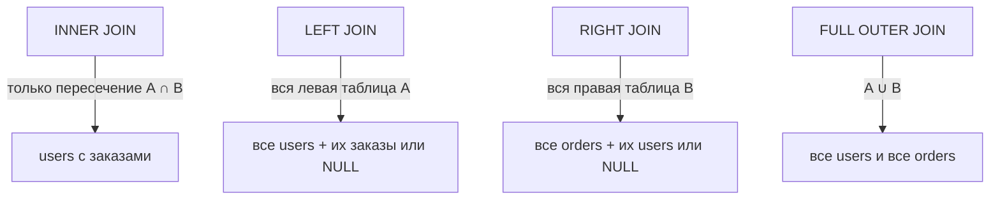

# SQL JOINs

JOIN — оператор SQL для объединения строк из двух или более таблиц по связанному столбцу. Без JOIN пришлось бы делать несколько отдельных запросов и собирать данные в коде.

## Виды JOIN

**INNER JOIN** — только строки, у которых есть совпадение в обеих таблицах.

```sql
SELECT users.name, orders.amount
FROM users
INNER JOIN orders ON users.id = orders.user_id;
-- Вернёт только пользователей, у которых есть заказы
```

**LEFT JOIN** — все строки из левой таблицы, совпадения из правой (NULL если нет).

```sql
SELECT users.name, orders.amount
FROM users
LEFT JOIN orders ON users.id = orders.user_id;
-- Вернёт ВСЕХ пользователей, даже без заказов (amount = NULL)
```

**RIGHT JOIN** — все строки из правой таблицы + совпадения из левой (встречается редко).

**FULL OUTER JOIN** — все строки из обеих таблиц, NULL там, где нет совпадений.

```sql
SELECT users.name, orders.amount
FROM users
FULL OUTER JOIN orders ON users.id = orders.user_id;
```

## Схема



## Сравнение JOIN по зонам пересечения



## Практические примеры

```sql
-- Найти пользователей БЕЗ заказов
SELECT users.name
FROM users
LEFT JOIN orders ON users.id = orders.user_id
WHERE orders.id IS NULL;

-- Сумма заказов по каждому пользователю
SELECT users.name, SUM(orders.amount) AS total
FROM users
INNER JOIN orders ON users.id = orders.user_id
GROUP BY users.id, users.name
ORDER BY total DESC;

-- JOIN трёх таблиц
SELECT users.name, orders.amount, products.title
FROM users
INNER JOIN orders ON users.id = orders.user_id
INNER JOIN products ON orders.product_id = products.id;
```

## Карточки

- В чём разница между INNER JOIN и LEFT JOIN?
- Что вернёт LEFT JOIN если в правой таблице нет совпадений?
- Как найти записи, у которых нет связанных строк в другой таблице?
- Чем FULL OUTER JOIN отличается от INNER JOIN?
- Можно ли объединить больше двух таблиц через JOIN?
