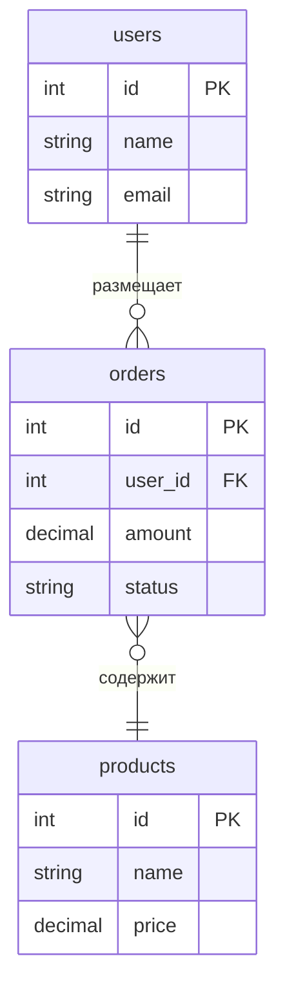
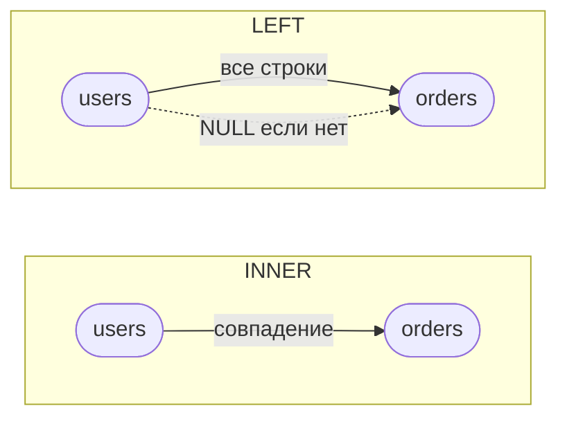

# SQL JOINs

JOIN — оператор SQL для объединения строк из двух или более таблиц по связанному столбцу. Без JOIN пришлось бы делать отдельные запросы и связывать данные в коде приложения.

## Виды JOIN

**INNER JOIN** — возвращает только строки, у которых есть совпадение в обеих таблицах. Самый распространённый тип.

**LEFT JOIN** (LEFT OUTER JOIN) — все строки из левой таблицы + совпавшие из правой. Несовпавшие поля правой таблицы равны `NULL`.

**RIGHT JOIN** (RIGHT OUTER JOIN) — все строки из правой таблицы + совпавшие из левой. Редко используется — обычно меняют порядок таблиц и берут LEFT JOIN.

**FULL OUTER JOIN** — все строки из обеих таблиц. Несовпадения с обеих сторон заполняются `NULL`.

**CROSS JOIN** — декартово произведение: каждая строка левой таблицы соединяется с каждой строкой правой. Без условия ON.

```sql
-- INNER JOIN: только заказы с существующим клиентом
SELECT o.id, u.name, o.amount
FROM orders o
INNER JOIN users u ON o.user_id = u.id;

-- LEFT JOIN: все пользователи, включая тех у кого нет заказов
SELECT u.name, COUNT(o.id) AS order_count
FROM users u
LEFT JOIN orders o ON u.id = o.user_id
GROUP BY u.id;

-- Три таблицы
SELECT u.name, o.id, p.name AS product
FROM orders o
INNER JOIN users u    ON o.user_id = u.id
INNER JOIN products p ON o.product_id = p.id;
```

## Схема





## Карточки

- Чем INNER JOIN отличается от LEFT JOIN?
- Что вернёт LEFT JOIN, если в правой таблице нет совпадений?
- Когда использовать FULL OUTER JOIN?
- Что такое CROSS JOIN и зачем он нужен?
- Как соединить три таблицы через JOIN?
