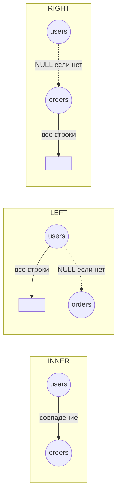

# SQL JOINs

JOIN — оператор SQL для объединения строк из двух или более таблиц на основе связанного столбца (обычно внешний ключ → первичный ключ).

## Виды JOIN

**INNER JOIN** — возвращает только строки, у которых есть совпадение в обеих таблицах.

**LEFT JOIN** — все строки из левой таблицы + совпадающие строки из правой; если совпадения нет — `NULL`.

**RIGHT JOIN** — все строки из правой таблицы + совпадающие из левой; если нет — `NULL`.

**FULL OUTER JOIN** — все строки из обеих таблиц, `NULL` там, где нет совпадения.

```sql
-- INNER JOIN: только заказы с существующим пользователем
SELECT u.name, o.total
FROM users u
INNER JOIN orders o ON u.id = o.user_id;

-- LEFT JOIN: все пользователи, даже без заказов
SELECT u.name, o.total
FROM users u
LEFT JOIN orders o ON u.id = o.user_id;

-- Три таблицы подряд
SELECT u.name, o.total, p.name AS product
FROM users u
JOIN orders o ON u.id = o.user_id
JOIN products p ON o.product_id = p.id;
```

## Схема



## Советы

- Всегда используй алиасы таблиц (`u`, `o`) — код становится читаемее
- `INNER JOIN` — самый частый вид, используй по умолчанию
- При `1:N` связи JOIN может умножать строки — проверяй количество результатов
- Индексируй колонки из условия `ON` для ускорения запроса
- `LEFT JOIN` + `WHERE o.id IS NULL` — способ найти строки без пары (anti-join)

## Карточки

- Чем отличается INNER JOIN от LEFT JOIN?
- Что вернёт LEFT JOIN если нет совпадений в правой таблице?
- Как объединить три таблицы через JOIN?
