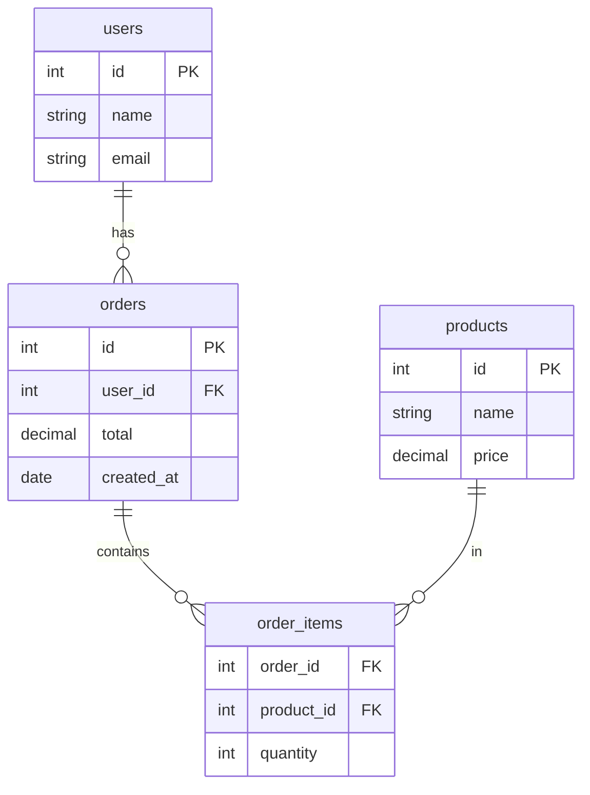

# SQL JOINs

JOIN объединяет строки из двух и более таблиц по условию связи. Выбор типа JOIN определяет, что происходит со строками, у которых нет совпадения в другой таблице.

## Типы JOIN

| Тип | Что возвращает |
|-----|----------------|
| `INNER JOIN` | Только строки с совпадением в обеих таблицах |
| `LEFT JOIN` | Все строки левой + совпадения из правой (NULL если нет) |
| `RIGHT JOIN` | Все строки правой + совпадения из левой (NULL если нет) |
| `FULL OUTER JOIN` | Все строки из обеих таблиц, NULL где нет совпадения |

## Примеры

```sql
-- INNER JOIN: только пользователи с хотя бы одним заказом
SELECT u.name, o.total
FROM users u
INNER JOIN orders o ON u.id = o.user_id;

-- LEFT JOIN: все пользователи, даже без заказов (total = NULL)
SELECT u.name, o.total
FROM users u
LEFT JOIN orders o ON u.id = o.user_id;

-- Несколько JOIN
SELECT u.name, o.total, p.name AS product
FROM orders o
JOIN users u    ON o.user_id    = u.id
JOIN products p ON o.product_id = p.id
WHERE o.total > 100;
```

## Схема



## Частые ошибки

**Декартово произведение** — если забыть условие ON, каждая строка первой таблицы соединяется с каждой строкой второй:

```sql
-- НЕВЕРНО: 1000 users × 500 orders = 500 000 строк
SELECT * FROM users, orders;

-- ВЕРНО
SELECT * FROM users JOIN orders ON users.id = orders.user_id;
```

**COUNT(\*) vs COUNT(column)** при LEFT JOIN:

```sql
-- Считает всех пользователей, включая тех без заказов
SELECT u.name, COUNT(*)
FROM users u LEFT JOIN orders o ON u.id = o.user_id
GROUP BY u.id;

-- Считает только заказы (NULL не считается)
SELECT u.name, COUNT(o.id)
FROM users u LEFT JOIN orders o ON u.id = o.user_id
GROUP BY u.id;
```

## Карточки

- Чем INNER JOIN отличается от LEFT JOIN?
- Что такое декартово произведение и как его избежать?
- Что вернёт LEFT JOIN для строк без совпадения?
- Чем COUNT(\*) отличается от COUNT(column) при LEFT JOIN?
