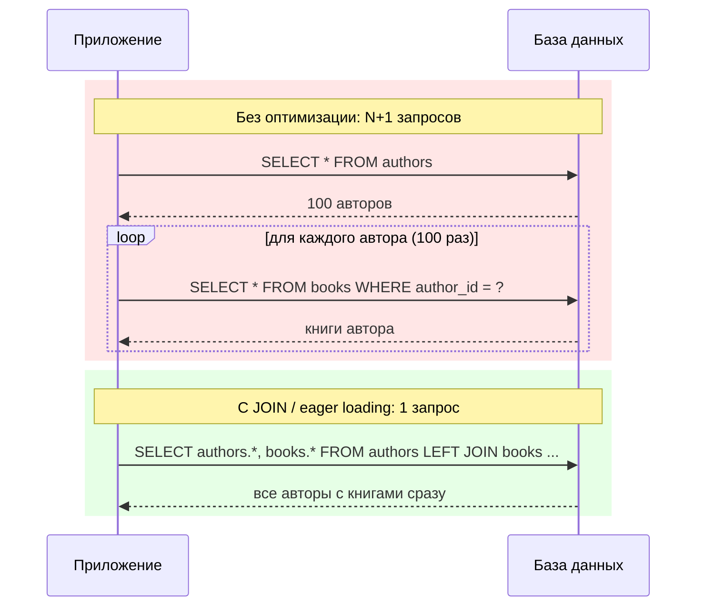

# Проблема N+1 запросов

**N+1 problem** — один из самых частых источников тормозов в backend-приложениях, использующих ORM. Суть: код делает **1 запрос**, чтобы получить список записей, а затем в цикле выполняет **ещё N запросов** — по одному на каждую запись — чтобы подтянуть связанные данные. В итоге вместо 1-2 обращений к базе происходит N+1.

## Как это возникает

Чаще всего проблема прячется за удобством ORM — **lazy loading** (ленивая загрузка связей). Связанные данные подгружаются автоматически при первом обращении к полю, и это обращение случайно оказывается внутри цикла.

```js
// ORM с lazy loading (псевдокод в духе Sequelize/TypeORM)
const authors = await Author.findAll();       // 1 запрос

for (const author of authors) {
  console.log(author.books.length);            // триггерит SELECT для КАЖДОГО автора
}
// Итого: 1 + N запросов
```

При 10 авторах это незаметно. При 10 000 — приложение может лечь под нагрузкой БД и вырасти в latency на порядки.

## Как обнаружить

- Включить логирование SQL в dev-режиме (`Sequelize: logging: console.log`, Django `django-debug-toolbar`, Prisma `log: ['query']`)
- Посмотреть на APM-трейс запроса (New Relic, Sentry, Datadog) — N+1 виден как «частокол» одинаковых по структуре запросов подряд
- Профилировщик БД (`pg_stat_statements` в PostgreSQL) покажет один и тот же шаблон запроса с разными параметрами, повторённый N раз

## Как избежать

| Способ | Идея | Когда использовать |
|---|---|---|
| **JOIN** | Получить всё одним SQL-запросом с объединением таблиц | Простые связи один-ко-многим |
| **Eager loading в ORM** | `include`/`with`/`relations` — ORM сам построит JOIN или batch | Стандартный случай в большинстве ORM |
| **Batch-запрос через IN** | Собрать все ID, получить связанные записи одним `WHERE id IN (...)`, сгруппировать в памяти | Когда JOIN даёт дублирование строк или неудобен |
| **DataLoader** | Батчинг + кэширование запросов в рамках одного тика event loop | GraphQL-резолверы |

```sql
-- Вместо N запросов по author_id — один JOIN
SELECT authors.*, books.*
FROM authors
LEFT JOIN books ON books.author_id = authors.id;
```

```js
// Eager loading вместо lazy loading
const authors = await Author.findAll({ include: Book }); // 1-2 запроса вместо N+1
```

## Компромиссы

JOIN может задублировать строки родительской таблицы (один автор × много книг), что требует дедупликации на стороне приложения. Batch-запрос через `IN` избегает дублирования, но требует ручной группировки результата. Eager loading в ORM обычно выбирает один из этих двух способов автоматически — важно понимать, какой именно, чтобы предсказывать нагрузку на БД.

## Схема



## Карточки

- Что такое проблема N+1 запросов и как её избежать?
- Чем JOIN отличается от batch-запроса с IN при решении N+1?
- Что такое eager loading и lazy loading в контексте ORM?
- Как обнаружить проблему N+1 в уже работающем приложении?
