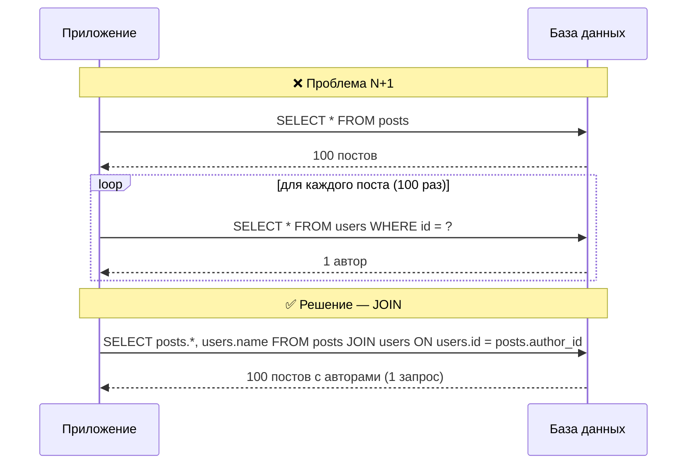

# Проблема N+1 запросов

N+1 — одна из самых частых причин медленных API у джуниоров. Суть: чтобы получить список сущностей и данные, связанные с каждой из них, код делает **1 запрос на список + N отдельных запросов** (по одному на каждую строку), вместо того чтобы получить всё за 1-2 запроса.

## Как возникает

Типичный сценарий — ORM или ручной SQL в цикле:

```js
// Получаем 100 постов
const posts = await Post.findAll(); // 1 запрос

// Для каждого поста отдельно тянем автора
for (const post of posts) {
  post.author = await User.findById(post.authorId); // +100 запросов!
}
```

Итог: 101 запрос к базе вместо одного. На проде с задержкой сети в 5-10 мс это добавляет **секунды** к времени ответа.

## Схема



## Как решить

**1. JOIN на уровне SQL**

```sql
SELECT posts.*, users.name AS author_name
FROM posts
JOIN users ON users.id = posts.author_id;
```

**2. Batching через `IN`**

Если JOIN неудобен (например, разные источники данных), собираем все ID и делаем один запрос:

```js
const posts = await Post.findAll();
const authorIds = [...new Set(posts.map(p => p.authorId))];
const authors = await User.findAll({ where: { id: authorIds } }); // 1 запрос вместо N
const authorsById = Object.fromEntries(authors.map(a => [a.id, a]));
posts.forEach(p => p.author = authorsById[p.authorId]);
```

**3. Eager loading в ORM**

Большинство ORM умеют подгружать связи заранее одним запросом:

```js
// Sequelize
const posts = await Post.findAll({ include: User });

// Django
posts = Post.objects.select_related('author')

// Prisma
const posts = await prisma.post.findMany({ include: { author: true } });
```

## Как обнаружить

- Включить логирование SQL-запросов и посмотреть на их количество при рендере одной страницы.
- Инструменты вроде `django-debug-toolbar`, `bullet` (Ruby), APM (New Relic, Datadog) сразу подсвечивают N+1.
- Простое правило: если количество запросов растёт вместе с количеством строк в списке — это N+1.

## Карточки

- Что такое проблема N+1 запросов?
- Как решить N+1 с помощью JOIN?
- Как решить N+1 без JOIN, если данные из разных источников?
- Как обнаружить N+1 в существующем коде?
