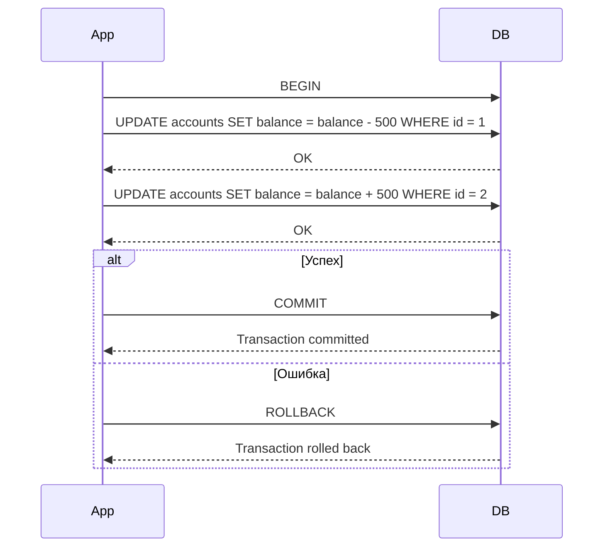

# SQL Транзакции и ACID

Транзакция — это набор SQL-операций, выполняемых как единое целое. Либо все операции успешно применяются, либо ни одна (всё откатывается). Это критично для финансовых операций, заказов, и любых связанных изменений.

## Принципы ACID

| Свойство | Описание |
|---|---|
| **Atomicity** (Атомарность) | Всё или ничего — частичных изменений нет |
| **Consistency** (Согласованность) | БД остаётся в корректном состоянии до и после |
| **Isolation** (Изолированность) | Параллельные транзакции не мешают друг другу |
| **Durability** (Долговечность) | После COMMIT изменения сохранены навсегда |

## Управление транзакциями

```sql
BEGIN; -- или START TRANSACTION

UPDATE accounts SET balance = balance - 500 WHERE id = 1;
UPDATE accounts SET balance = balance + 500 WHERE id = 2;

COMMIT;   -- сохранить все изменения

-- Если что-то пошло не так:
ROLLBACK; -- отменить все изменения в транзакции
```

## SAVEPOINT — частичный откат

SAVEPOINT позволяет откатиться к промежуточной точке, не отменяя всю транзакцию.

```sql
BEGIN;

INSERT INTO orders (user_id, total) VALUES (1, 1000);
SAVEPOINT after_insert;

UPDATE inventory SET stock = stock - 1 WHERE product_id = 5;
-- Если ошибка в UPDATE:
ROLLBACK TO after_insert; -- откат только до savepoint

COMMIT;
```

## Уровни изоляции

| Уровень | Грязное чтение | Неповторяемое чтение | Фантомное чтение |
|---|---|---|---|
| READ UNCOMMITTED | Да | Да | Да |
| READ COMMITTED | Нет | Да | Да |
| REPEATABLE READ | Нет | Нет | Да |
| SERIALIZABLE | Нет | Нет | Нет |

```sql
SET TRANSACTION ISOLATION LEVEL REPEATABLE READ;
BEGIN;
-- запросы
COMMIT;
```

## Схема



## Карточки

- Что такое транзакция в SQL?
- Что означают принципы ACID?
- Чем ROLLBACK отличается от COMMIT?
- Что такое SAVEPOINT и зачем он нужен?
- Какой уровень изоляции предотвращает все аномалии чтения?
