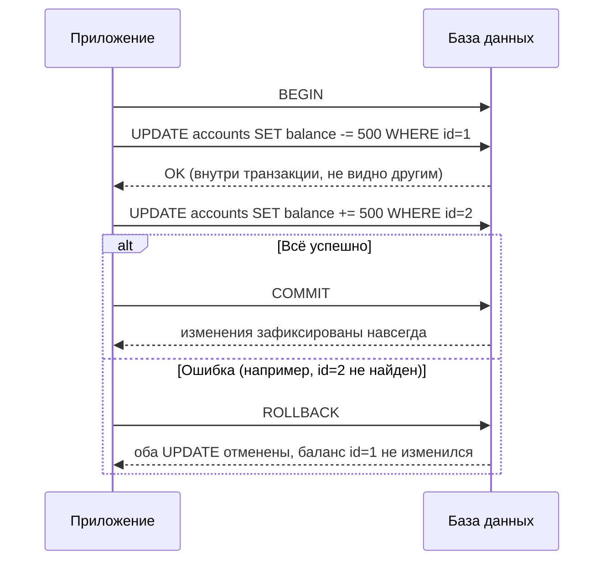

# Транзакции и ACID в SQL

**Транзакция** — группа SQL-операций, которая выполняется как единое целое: либо применяются **все** изменения, либо **ни одного**. Это базовый механизм защиты данных при ошибках, обрывах соединения и параллельном доступе.

## Жизненный цикл транзакции

```sql
BEGIN;

UPDATE accounts SET balance = balance - 500 WHERE id = 1;
UPDATE accounts SET balance = balance + 500 WHERE id = 2;

-- Если что-то пошло не так:
ROLLBACK;   -- откатывает ВСЕ изменения с BEGIN

-- Если всё успешно:
COMMIT;     -- фиксирует изменения навсегда
```

Без транзакции при сбое между двумя `UPDATE` деньги могут списаться у одного пользователя, но не зачислиться другому — база окажется в несогласованном состоянии.

## Принципы ACID

- **Atomicity (атомарность)** — транзакция выполняется целиком или не выполняется вовсе
- **Consistency (согласованность)** — база переходит из одного валидного состояния в другое (не нарушаются constraints, foreign key и т.д.)
- **Isolation (изолированность)** — параллельные транзакции не видят "промежуточных" изменений друг друга
- **Durability (долговечность)** — после `COMMIT` данные сохраняются даже при сбое сервера сразу после

## Уровни изоляции

Изоляция настраивается компромиссом между корректностью и производительностью:

| Уровень | Dirty Read | Non-repeatable Read | Phantom Read |
|---|---|---|---|
| `READ UNCOMMITTED` | возможен | возможен | возможен |
| `READ COMMITTED` (по умолчанию в PostgreSQL) | нет | возможен | возможен |
| `REPEATABLE READ` | нет | нет | возможен |
| `SERIALIZABLE` | нет | нет | нет |

- **Dirty Read** — чтение ещё не закоммиченных изменений другой транзакции
- **Non-repeatable Read** — повторный `SELECT` той же строки в рамках транзакции даёт другой результат
- **Phantom Read** — повторный `SELECT` по тому же условию возвращает другой **набор** строк

```sql
SET TRANSACTION ISOLATION LEVEL SERIALIZABLE;
BEGIN;
-- строгая изоляция, но выше риск конфликтов и повторных попыток
COMMIT;
```

## Схема: перевод денег между счетами



## Частые ошибки джуниора

- Забыть `COMMIT` — соединение держит незакоммиченную транзакцию, блокируя строки для других
- Открывать транзакцию на весь HTTP-запрос вместо только нужных операций — снижает пропускную способность БД
- Полагаться на `SERIALIZABLE` по умолчанию — на практике это не так почти нигде, нужно проверять настройки СУБД

## Карточки

- Что такое транзакция в SQL и зачем она нужна?
- Что означают буквы ACID?
- Чем Dirty Read отличается от Phantom Read?
- Что произойдёт, если не вызвать COMMIT после изменений?
- Какой уровень изоляции самый строгий и какова его цена?
